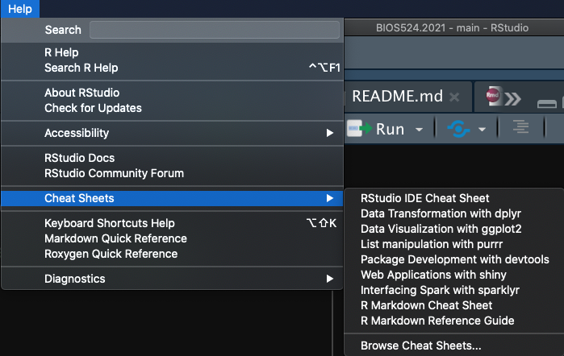
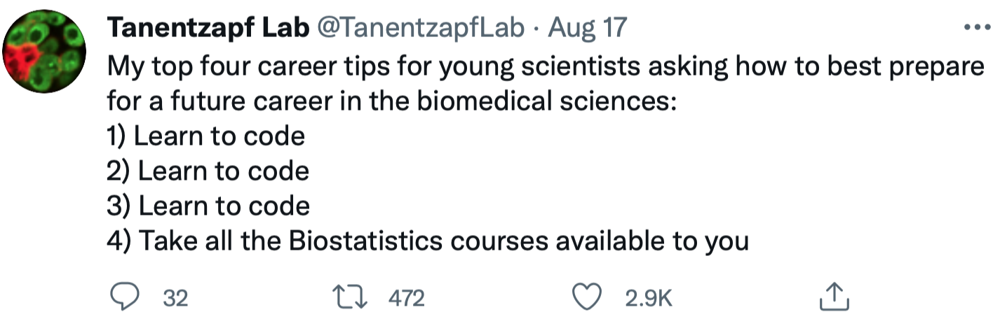

```{r xaringan-themer, include = FALSE}
library(xaringanthemer)
mono_light(
  base_color = "midnightblue",
  header_font_google = google_font("Josefin Sans"),
  text_font_google   = google_font("Montserrat", "500", "500i"),
  code_font_google   = google_font("Droid Mono"),
  link_color = "#8B1A1A", #firebrick4, "deepskyblue1"
  text_font_size = "28px",
  code_font_size = "26px"
)
```

# Why programming

- Programming will make your academic journey better

- Instead of remembering what button you clicked, you write scripts with exact commands that makes steps in your analysis clear and allow others to understand/reproduce it (or, spot mistakes)

- Programming forces you to have a deeper understanding of what you are doing, and facilitates your learning and comprehension of the methods you use

---
## Why R?

- R is a programming language designed for data analysis and statistics
    - Free, open-source and cross-platform

- An extremely powerful language for statistical modeling, machine learning, data manipulation, and visualization
    - Efficient data analysis on data of all shapes and sizes (big data including)
    - Optimized operations on vectors, matrices lists
    - Very sophisticated graphs and data displays

- Not just scripts, but fully reproducible reports, papers, presentations, web applications

.small[ https://www.r-project.org/ ]

---
## Why R?

- Thousands of packages that add extra functionality. Covering virtually all scientific disciplines and analytical frameworks.
    - Image analysis, geospatial, epidemiology, genetics, bioinformatics, and a lot more

- R can connect to spreadsheets, databases, and many other data formats, on your computer or on the web.

- Large and welcoming user community

.small[ https://www.r-project.org/

[18,000 CRAN packages, tweet by Dirk Eddelbuettel, 2021-08-11](https://twitter.com/eddelbuettel/status/1425425651092410369?s=20) ]

---
## RStudio

- RStudio is an interface IDE, integrated development environment) to work with R, with many features and functionalities for efficient work

- Free and open source

- Integrates file navigation, visualization, documentation, version control and project management

- You write the same R code in RStudio as you would elsewhere, and it executes the same way. RStudio helps by keeping things nicely organized

.small[ https://www.rstudio.com/products/rstudio/download/ ]

---
## Why RStudio

- Project-centric work - scripts and data are organized in one folder (project), easily accessible 

- Single workspace with four (rearrangeable, zoomable) panels

- Work on multiple projects simultaneously in several instances of RStudio

- Work on multiple (types of) scripts

- See all variables in R environment, easily visualize them

- Easy access to help, plots, packages

- Simple integration with Git version control system

- **After you install R and RStudio, you only need to run RStudio**

---
## RStudio interface

.center[]

---
## RStudio interface

RStudio is divided into 4 panes, by default:

- **Source** for scripts and documents (top-left)
- **Environment/History** (top-right),
- **Files/Plots/Packages/Help/Viewer** (bottom-right)
- **R Console** (bottom-left)

Additional goodies:

- Autocompletion
- Highlightning
- Keyboard shortcuts
- Many more

---
## RStudio help

.center[]

---
## Installing and loading packages

```{r echo=TRUE, eval=FALSE}
install.packages("cowsay")
```

```{r echo=TRUE}
library(cowsay)
say('time')
```

---
## Getting started with R

```{r echo=TRUE, eval=FALSE}
install.packages("swirl")
```

```{r echo=TRUE}
library(swirl)
```

---
## RStudio is more than IDE

RStudio PBC develops many now-gold-standard R packages

- `tidyverse` – R packages for data science, including ggplot2, dplyr, tidyr, and purrr

- `shiny` – An interactive web technology

- `rmarkdown` – Insert R code into markdown documents

- `knitr` – Dynamic reports combining R, TeX, Markdown & HTML

- `tensorflow` - open-source software library for Machine Intelligence

- `reticulate` - provides a comprehensive set of 

- `devtools` – Package development tool

---
## Getting help

- Get an overview of all functions in a package: `help(package = "dplyr")`

- Use `?function_name` to get help on a function from a _loaded_ package. E.g., `?boxplot` (same as `help(boxplot)`)
    - Use `example(boxplot)` to see how the function can be used

- Use `??function_name` to search for the function across all installed packages, even not loaded. E.g., `??ggplotly`

- Search engine is your best friend

---
## References

- Introduction to bioinformatics, https://uclouvain-cbio.github.io/WSBIM1207/sec-rrstudio.html

- Orientation to programming, R, and RStudio, https://gge-ucd.github.io/R-DAVIS/lesson_intro_r_rstudio.html

---
## Learn to code

.center[]

https://twitter.com/TanentzapfLab/status/1427720047431065601?s=20

<!--
class: center, middle

# Welcome

---
## Mikhail Dozmorov, PhD

- Associate professor, Department of Biostatistics, VCU

- Bioinformatics
- Genomics
- Data Science
- Computational Biology

.small[ https://medschool.vcu.edu/expertise/detail.html?id=mdozmorov ]

---
## Class facilitator/TA

- **Joseph Boyle**
    - Ph.D. Student, Second Year
    - Student Representative
    
- He will be helping with homework assignments and online sessions

---
## Biostatistical Computing with R

- This is a brand new course for me
- I expect to make mistakes or forget something

- Let's maintain a welcoming and supportive environment
    - Ask as many questions during the class as necessary! Worst case - I'll address them later, if not covered during the class
    - Respect each other

- Please keep your video on. I won't face your directly but will keep the participants' window on a second screen

- Lectures won't be recorded, so make all efforts to attend each class
    - Joseph will keep track of attendance

---
## Teaching style

- Learning through practice - this means you will always do something hands-on

- While doing, you will need to google for help - you will learn a lot from other resources

- Always ask questions!

---
## Learning Objectives

By the end of this course, you will be able to:

- Understand and utilize R/RStudio

- Share your code on GitHub

- Understand basic data types and data structures in R

- Execute and interpret some basic statistics in R

- Familiarize and load data files (Excel, Comma Separated Value files) into R/Rstudio, with tips on formatting and data organization

- Filter and format data in R for use with various routines

- Visualize datasets using ggplot2 and understand how to build basic plots using ggplot2 syntax

---
## Rules for interaction

- Post questions in a chat
    - If anyone knows answers, please, post them there
    - I'll try to allocate time at the end of each class to review the chat
    - Note chat history is gone as soon as the lecture is ended

- [Slack](https://slack.com/). See [Slack 101](https://slack.com/resources/slack-101)
    - I will send invites using your VCU e-mail addresses - use them to join the [#bios524 channel](https://dozmorovlab.slack.com/archives/C01AZANCZR9)
    - Omit formalities, but be respectful and polite
    - Questions and answers posted there will be available for everyone - answer them if you can, or I'll address them
    - Direct messages are possible - use them to ask private questions or schedule a meeting
    - I'll try to answer your questions asap, typically, within 24 hours

---
## Class Assignments

- Homeworks should be submitted via Blackboard, or as instructed

- Homeworks are due 1 week after the class. E.g., homework for September 22 class is due September 29, 5:00pm Eastern time

- A final project will conclude the course

- Office hours. I'll end the class sessions at 2:20pm, and will be available at https://zoom.us/my/mdozmorov, 2:30-3:30pm unless unexpected meetings
-->

