```{r xaringan-themer, include = FALSE}
library(xaringanthemer)
mono_light(
  base_color = "midnightblue",
  header_font_google = google_font("Josefin Sans"),
  text_font_google   = google_font("Montserrat", "500", "500i"),
  code_font_google   = google_font("Droid Mono"),
  link_color = "#8B1A1A", #firebrick4, "deepskyblue1"
  text_font_size = "28px",
  code_font_size = "26px"
)
```

## R history

- Elegant, object-oriented programming language.
  - Started by Robert Gentleman and Ross Ihaka (hence `R`) in 1995 as a free, independent, open-source implementation of the `S` programming language
  - Currently, maintained by the R Core development team

- An extremely powerful language for statistical modeling, machine learning, data manipulation, and visualization.
  - Efficient data analysis
  - Optimized operations on vectors, matrices lists
  - Very sophisticated graphs and data displays


---
## More R history

.small[
- 1992: R development begins as a research project in Auckland, NZ by Robert Gentleman and Ross Ihaka 
- 1993: First binary versions of R published at Statlib
- 1995: R first distributed as open-source software, under GPL2 license
- 1997: R core group formed
- 1997: CRAN founded (by Kurt Jornik and Fritz Leisch)
- 1999: The R website, r-project.org, founded
- 1999: First in-person meeting of R Core team, at inaugural Directions in Statistical Computing conference, Vienna
- 2000: R 1.0.0 released (February 29) 
- 2000: John Chambers, recipient of the 1998 ACM Software Systems Award for the S language, joins R Core
- 2001: R News founded (later to become the R Journal)
- 2003: R Foundation founded
- 2004: First UseR! conference (in Vienna)
- 2004: R 2.0.0 released
- 2009: First edition of the R Journal
- 2013: R 3.0.0 released
- 2015: R Consortium founded, with R Foundation participation
- 2016: New R logo adopted
- 2020: R 4.0.0 released

https://blog.revolutionanalytics.com/2017/10/updated-history-of-r.html ]

---
## Organizations behind R

- **The R project**, https://www.r-project.org/
    - R source code contributors: https://www.r-project.org/contributors.html

- **Comprehensive R Archive Network (CRAN)**, https://cran.r-project.org/
    - Download and install R

- **RStudio**, https://www.rstudio.com/
    - Download RStudio: https://www.rstudio.com/products/rstudio/#Desktop

- **Bioconductor**, https://bioconductor.org/

---
## Bioconductor

"Is an open source and open development software project to provide tools for the analysis and comprehension of genomic data."

**Goals**

- To provide widespread access to a broad range of powerful statistical and graphical methods for the analysis of genomic data

- To provide a common software platform that enables the rapid development and deployment of extensible, scalable, and interoperable software

- To further scientific understanding by producing high-quality documentation and reproducible research

- To train researchers on computational and statistical methods for the analysis of genomic data

---
## Advantages and disadvantages of `R`

- Free and easy to install

- Highly extensible through packages, collections of functions, data, and documentation

- Active developer community

- Anyone can contribute

- Some learning curve

- No centralized support

- Less consistency in function/variable naming and structure

---
## Install/update R

- Installation for Windows, Mac, and Linux is available

- New version of R is released every 6 month, typically around April/October
    - Bioconductor updates follow shortly thereafter

- Use `installr` R package to cleanly update R on Windows

.center[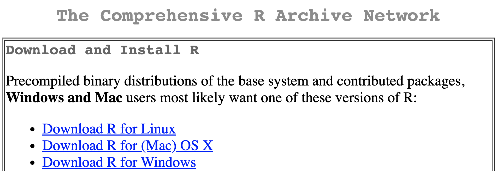]

.small[ https://cran.r-project.org/, https://CRAN.R-project.org/package=installr ] 

---
## Run R

.pull-left[
- Command line. Type `R` and enter the R prompt
    - Type `R CMD` to see the list of available commands
    - Type `Rscript` to see how you can run R commands and scripts from the command line. E.g., `Rscript -e 'print("Hello, world!")'`

- R console, installs with R

- Rcommander. GUI for better interactions with R

]

.pull-right[

- RStudio. Integrated development environment for basic and advanced R operations
]

## RStudio

* RStudio is a program that allows you to run R in a more user-friendly environment
    * RStudio offers some GUI (graphical user interface) features for R

* RStudio is a very flexible IDE (Integrated development environment)
    * The same R program is running underneath the interface

* RStudio is open-source software (and therefore is free)
    * Available for download at: http://rstudio.com


    
---
## Why RStudio

- Project-centric work - scripts and data are organized in one folder (project), easily accessible 

- Single workspace with four (rearrangeable, zoomable) panels

- Work on multiple projects simultaneously in several instances of RStudio

- Work on multiple (types of) scripts

- See all variables in R environment, easily visualize them

- Easy access to help, plots, packages

- Simple integration with Git version control system

- **After you install R and RStudio, you only need to run RStudio**

---
## RStudio main window

.center[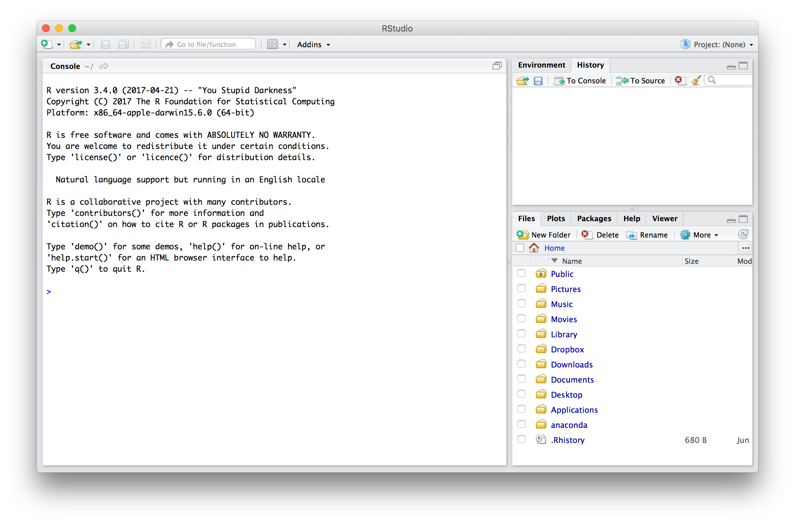]

---
## R Console

.center[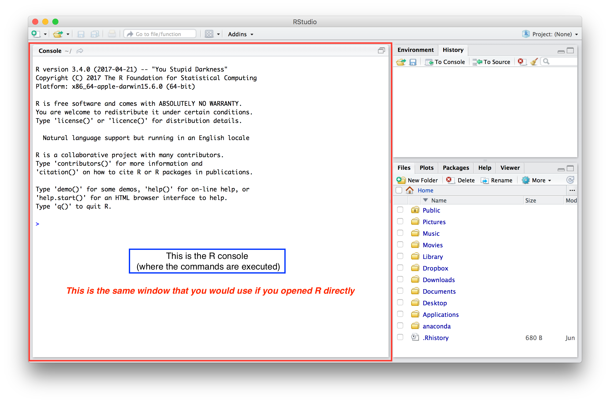]

---
## Create/open new script or other file

.center[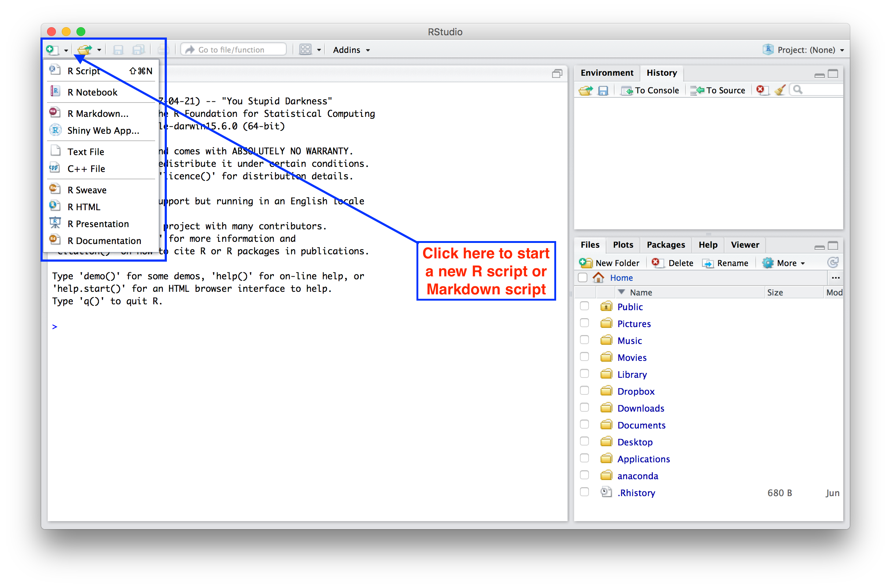]

---
## Open an existing script:

.center[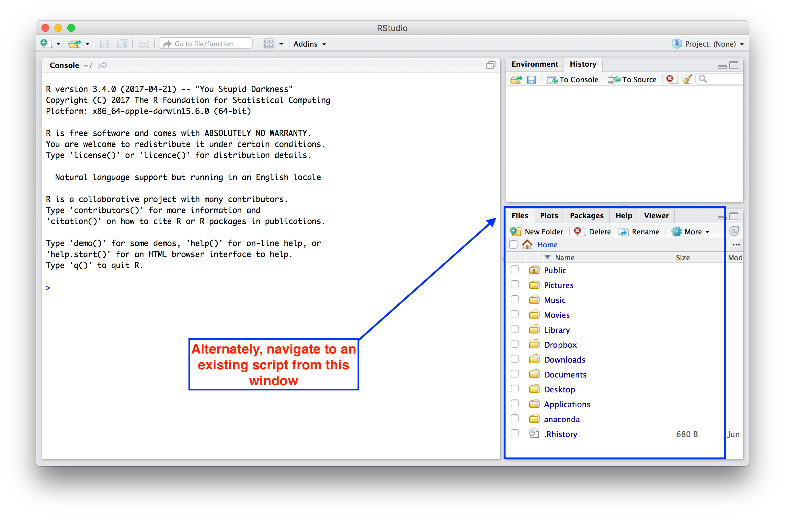]

---
## Rearrangeable tabbed interface 

.center[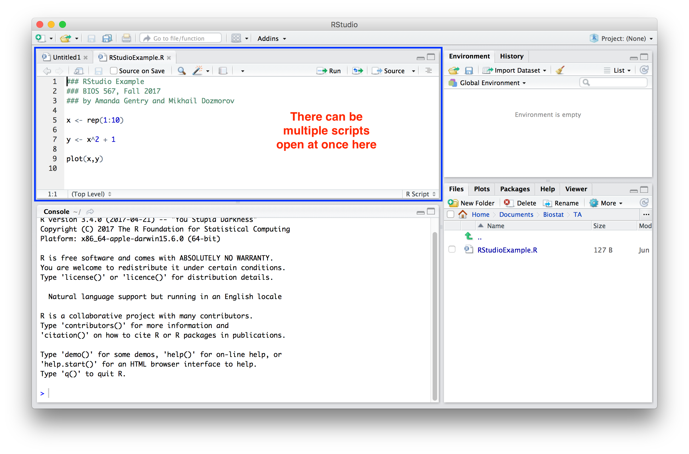]

---
## History of commands

.center[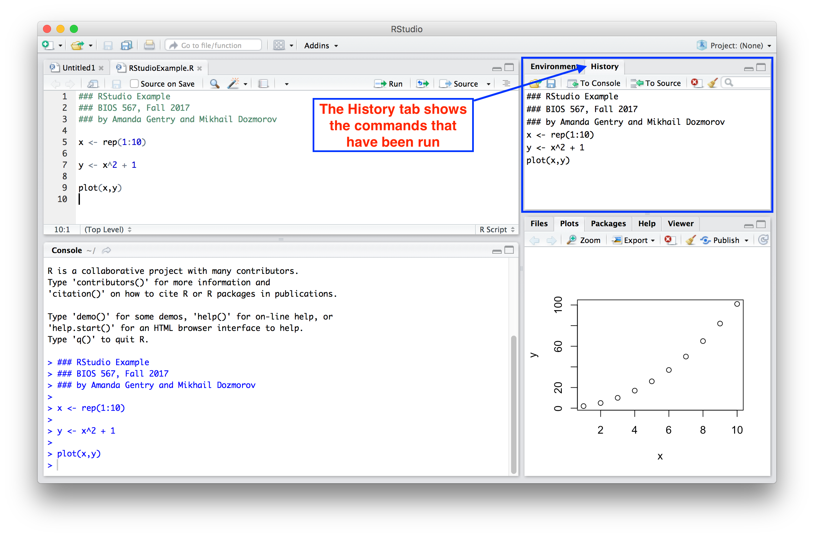]

---
## Environment tab 

.center[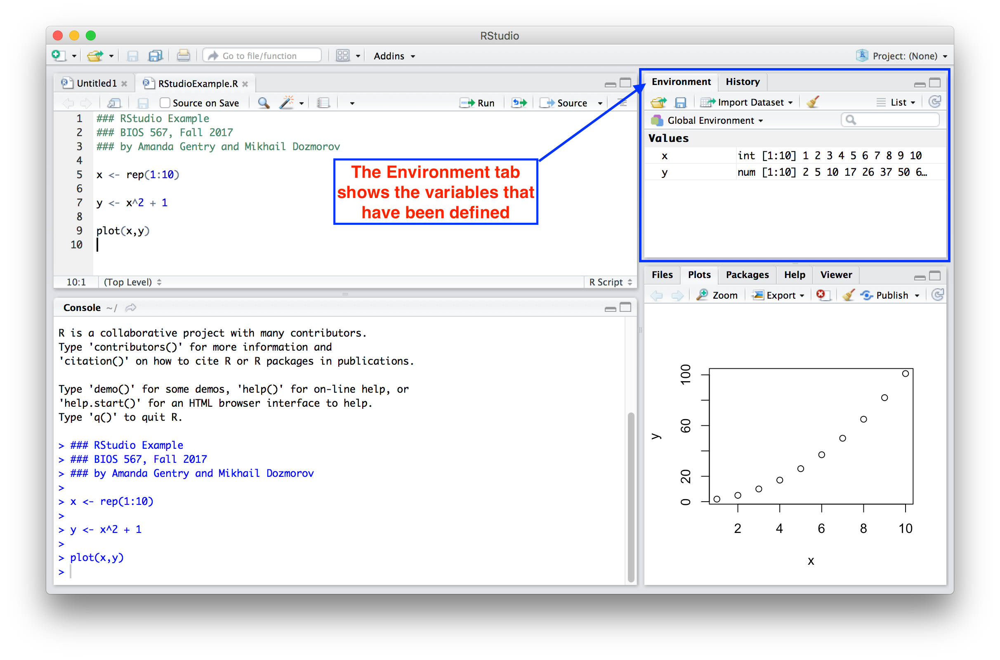]

---
## Plots tab

.center[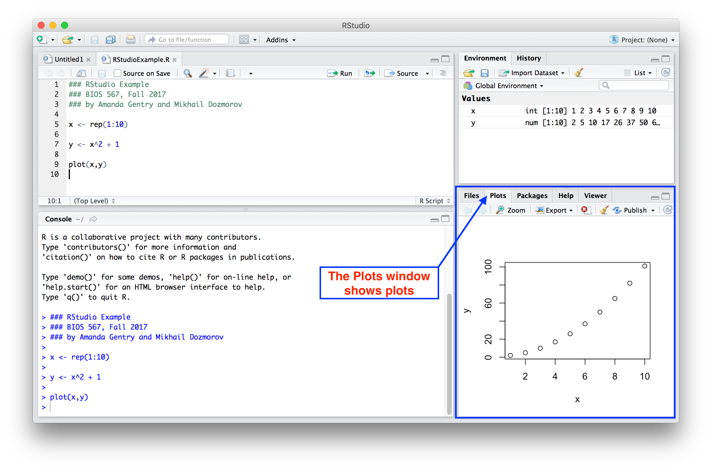]

---
## RStudio keyboard shortcuts

- Command (Ctrl) + Enter - Run current line/selection, go to the next line  
- Alt + Enter - Run current line/selection, stay on the current line
- Ctrl + 1 - Move cursor to source  
- Ctrl + 2 - Move cursor to console  
- Ctrl + L - Clear console
- Ctrl + Alt + I - Create new code chunk
- Ctrl + Alt + c - Run current code chunk
- All the usual - Ctrl + Z, C, X, V, S, O

See more via menu "Help -> Keyboard Shortcuts Help", "Help -> Cheatsheets"

.small[https://support.rstudio.com/hc/en-us/articles/200711853-Keyboard-Shortcuts]

---
## RStudio settings

- Set to "Never" the 'Save workspace to .RData on exit' option and uncheck the 'Restore .RData into workspace at startup' option in "Tools/Global Options/General"

.center[]

---
## RStudio settings

- In "Tools/Global Options/Code", check 'Enable code snippets', look what snippets are available and add your own. In the "Completion" tab, set completion delay to 0ms.

.center[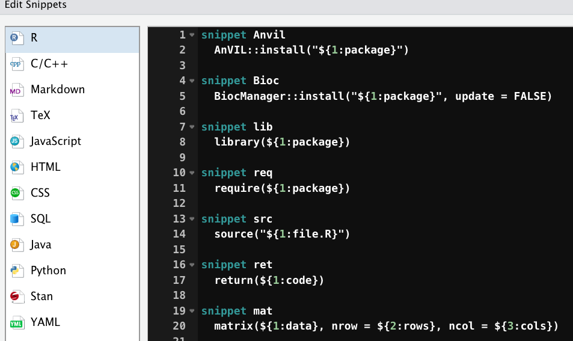]

---
## RStudio settings

- In the "Saving" tab, set 'UTF-8' as default text encoding, to avoid character encoding issue between Windows and other operating systems

.center[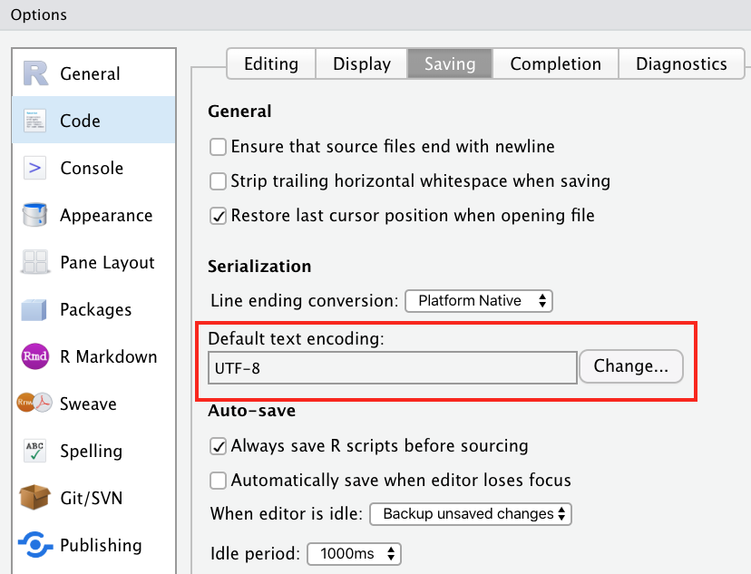]

---
## RStudio is more than IDE

RStudio PBC develops many now-gold-standard R packages

- `tidyverse` – R packages for data science, including ggplot2, dplyr, tidyr, and purrr

- `shiny` – An interactive web technology

- `rmarkdown` – Insert R code into markdown documents

- `knitr` – Dynamic reports combining R, TeX, Markdown & HTML

- `tensorflow` - open-source software library for Machine Intelligence

- `reticulate` - provides a comprehensive set of packages for working with Python

- `devtools` – Package development tool

---
## RStudio cloud

.pull-left[
**Getting started locally**

- Install R
- Install RStudio
- Install packages (`rmarkdown`, `tidyverse`)
- Load packages
- Install Git
...
]

.pull-right[
**Getting started online**

- Go to https://rstudio.cloud/
- Register or log-in with Google, GitHub (recommended) accounts
]

---
## RStudio cloud

.center[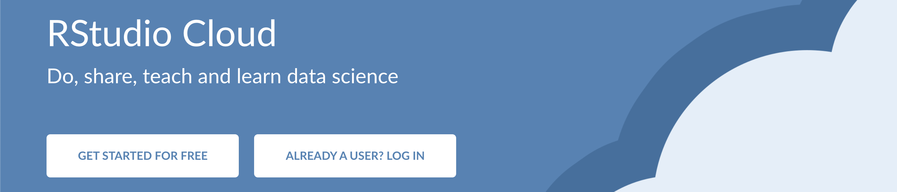]

- An online, cloud-based instance of RStudio IDE, accessible via a web browser
- No hardware requirements or software setup requirements from the user's side
- Share projects with specific people or anyone
- Import projects from GitHub
- Free plan is always available (up to 15 projects, 1 shared space, 15 project-hours per month, up to 1Gb RAM and 1 CPU per project)

.small[ https://rstudio.cloud/ ]


