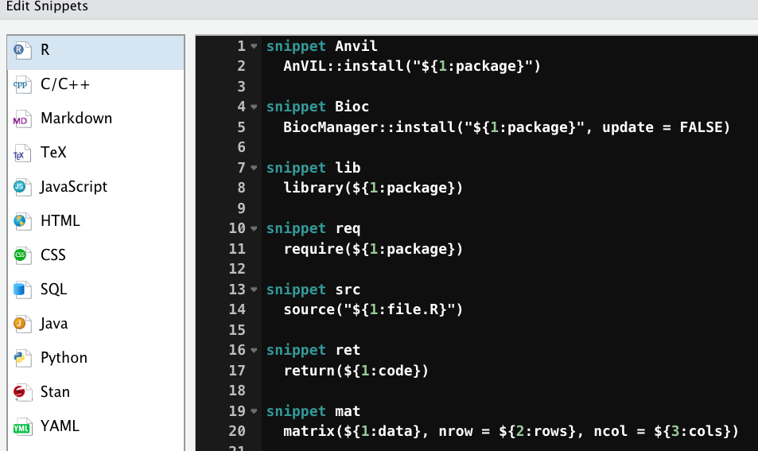

```{r xaringan-themer, include = FALSE}
library(xaringanthemer)
mono_light(
  base_color = "midnightblue",
  header_font_google = google_font("Josefin Sans"),
  text_font_google   = google_font("Montserrat", "500", "500i"),
  code_font_google   = google_font("Droid Mono"),
  link_color = "#8B1A1A", #firebrick4, "deepskyblue1"
  text_font_size = "28px"
)
```
```{r xaringanExtra, echo=FALSE}
xaringanExtra::use_xaringan_extra(c("editable", "panelset"))
```


## Summary of the previous class

.panelset[
.panel[.panel-name[Objects]

- Everything that exists in R is an **object**
- Everything that happens in R is a **call to a function**
- The assignment operator: ` <- `, preferred over ` = `  
- Do not name objects with [Reserved Words in R](https://stat.ethz.ch/R-manual/R-devel/library/base/html/Reserved.html) like `if else while function for TRUE FALSE NULL Inf NaN NA`
]
.panel[.panel-name[Object types]
.can-edit[
- Scalars, `a <- 3.14`
- Vectors, `b <- c(1, 2)` or `b <- c(1, "2")`
    - Vectors can be named, `names(b) <- c("First", "Second")`. Use `unname()` to remove.
- Matrices, `mat <- matrix(data = 0, nrow = 2, ncol = 2)`
- Data frames, `dat = data.frame(Column.1 = c(3, 1, 3), Column.2 = c("2", "3", "2"))`
- Boolean, `TRUE` or `FALSE`
- Factors, `factor(c("Cats", "Dogs"), levels = c("Dogs", "Cats"))`
]
]

.panel[.panel-name[Subsetting]

.can-edit[
- Access to elements using `[]`
- Row/column indexes start from 1, `dat[1, 2]`
- Columns in data frames can be accessed with `$`, `dat$Column.1`
- Elements can be subsetted using Boolean indexes, `a[c(TRUE, FALSE)]`
- Avoid spaces in column names, as well as numerical column names
    - If absolutely necessary, wrap column names in forward ticks, `dat$1`
]
]
.panel[.panel-name[Auxillary functions]

.can-edit[
- `class(a)`, `str(a)`, `is.character(a)`, `as.character(b)`
- `dim(dat)`, `nrow(dat)`, `ncol(dat)`, `length(dat)`, `colnames(dat)`, `rownames(dat)`
- `head()`, `tail()`, `summary()`
- Use `?` on any function to get help, `?cor`
- Type function name without parentheses to see its code, `cor`
]
]
]

---
## Sequences of elements

```{r}
rep(c(1, 2, 3), 5)
seq(from = 1, to = 20, by = 2)
1:5
5:1
```

---
## Sequences of characters

.panelset[
.panel[.panel-name[Sequence of characters]
```{r eval=FALSE}
"a":"e"
```
]
.panel[.panel-name[Results]
```{r eval=FALSE}
"a":"e"
Error in "a":"e" : NA/NaN argument
In addition: Warning messages:
1: NAs introduced by coercion 
2: NAs introduced by coercion 
```
]
.panel[.panel-name[Solutions]
.can-edit[
```{r}
head(letters)
tail(LETTERS)
month.abb
month.name
pi
```
]
]
]

---
## Lists

- **Lists**: objects containing elements of different types
    - Each list element can be of different length
    
```{r}
lst = list(A = rep(2, 5), B = seq(1:5), C = letters[1:10])
lst
unlist(lst)
```

---
## Addressing elements in a list

- Address any element as `lst[1]` (or, `lst["A"]`)

```{r}
lst[1]
```

- Address _the content of any element_ as `lst[[1]]` (or, `lst[["A"]]`, `lts$A`)

```{r}
lst[[1]]
```

---
## Logical operators

.can-edit[
```{r eval=FALSE}
3 < 4 & "a" == "b"
```
]

- Like arithmetic operations, logic statements follow the order of preference. Operators `>`, `==`, `!` etc. are evaluated before `&` and `|`
- If in doubt, wrap your expressions in parentheses

.can-edit[
```{r eval=FALSE}
(3 < 4) & ("a" == "b")
```
]

---
## Logical operators

.panelset[
.panel[.panel-name[Evaluation]

```{r}
1 + 2 == 3
```

What do you think will happen if we evaluate `0.1 + 0.2 == 0.3`?

]
.panel[.panel-name[Caveats]
```{r}
0.1 + 0.2 == 0.3
```

**Problem:** Computers represent numbers as binary (i.e. base 2) floating-points. [Read more](https://floating-point-gui.de/basic/)

**Solution:** Use `all.equal()` for evaluating floats (i.e fractions).

```{r}
all.equal(0.1 + 0.2, 0.3)
```

]

]

---
## Value matching

- To see whether an object is contained within (i.e. matches one of) a list of items, use `%in%`

```{r}
5 %in% 1:10
1:10 %in% 5
```

- Value matching can be useful to subset R objects

```{r}
pvals <- c(0.05, 0.04, 0.09, 0.03, 0.12)
pvals[pvals <= 0.05]
```


---
## Comments

R ignores everything after the `#` sign

```{r}
# This line is a comment
print("Hello, World!") # This will print the message, but the comment will be ignored
```

---
## Clean up your environment

```{r}
z <- c(1, 2, 3)
ls()
rm(z) # Remove one variable
ls()
# Remove everything from the environment
rm(list = ls()) # Not the same as restarting R session
ls()
```


---
## Functions

- A function is a set of statements organized together to perform a specific task
    - **Name** - the actual name of the function, e.g., `summary()`, `mean()`
    - **Arguments** - values passed to the functions. Argument-less functions exist
    - **Code** - actual code of the function
    - **Return value** - the result of the function's code execution

``` r
read.csv(file="scores.csv")
```

`read.csv` is a function to import a CSV file, and `file` is an argument that specifies which file to import

R has a large number of built-in functions, and the user can create their own functions

---
## Running functions

- From the R console - type the function and hit Enter
    - One function at a time, not efficient

- Using an `R` script - a text file that contains all your `R` functions/code
    - `R` scripts allow you to save, edit, reproduce and share your code
    - R scripts stored in files with `.R` extension
    - Run the whole script as `source("script_name.R")`, or, from command line, `Rscript script_name.R`
    - In RStudio, you can run individual lines, code chunks, or source whole scripts. Keyboard shortcuts are available

---
## Packages

- All functions belong to *packages*. The `read.csv` function is in the `utils` package.

- `R` comes with about 30 packages (called "base `R`"), but as of August 2021, there are over 18,000 CRAN packages and over 2,000 Bioconductor packages

- Example: `ggplot2` is a popular package that adds functions for creating graphs in a different way than what base `R` provides

- To use functions in a package, the package must be installed and loaded. (They're free)
- You only _install_ a package once
- You _load_ a package whenever you want to use its functions

---
## Package repositories

- `CRAN` - Comprehensive R Archive Network – a collection of > 18,000 (September 2021) packages

- `Bioconductor` – genomics-oriented free and open source project hosting > 2,000 specialized R packages (September 2021)

- `MRAN` - Microsoft R Application Network, includes CRAN packages and more

- `GitHub` – code-hosting repository, packages for everyone and by everyone

.small[ https://cran.r-project.org/web/packages/ 

https://www.bioconductor.org/

https://mran.microsoft.com/

https://github.com/  ]

---
## Installing packages

- `install.packages(“<package_name>”)` - installs packages from CRAN, e.g., `install.packages("BiocManager")`

- `install.packages(“<package_name.tar.gz>”, repos = NULL)` – install from a tarball archive

- `R CMD INSTALL <package_name.tar.gz>` - install from a command line

- `remotes` package - installs R packages from GitHub, GitLab, Bitbucket, Bioconductor, or plain 'subversion' or 'git' repositories. E.g., `remotes::install_github("tidyverse/ggplot2")`

- `BiocManager::install()` - Install or update Bioconductor, CRAN, or GitHub packages

.small[ https://CRAN.R-project.org/package=BiocManager ]

---
## Installing packages

- `AnVIL::install()` - Install package binaries, speeds up installation process

- RStudio point-and-click interface

.center[]

---
## Loading packages

- `library()` will load the package, e.g., `library(readxl)` or `library("readxl")`
    - But, when installing packages, always use parentheses, e.g., `install.packages("readxl")`

- `require()` will load the package and, if success, return TRUE. Useful in `if` statement, e.g.

``` r
if (!require(ggplot2)) {
  install.packages("ggplot2")
}
```

---
## Loading packages

- `library(package_name)` – load library to use its functions

- `library()` vs. `require()`
    - `require()` _tries_ to load the package, returns TRUE or FALSE
    - `library()` just loads the package, fails if the package is not available

- Use only `library(package_name)`

.small[ https://yihui.name/en/2014/07/library-vs-require/ ]

---
## Using functions from other packages

- You can access functions without loading the package using the `::` operator, e.g., `Hmisc::rcorr()`

- Entering the function name without parentheses will output its code

``` r
> data.frame
function (..., row.names = NULL, check.rows = FALSE, check.names = TRUE, 
    fix.empty.names = TRUE, stringsAsFactors = default.stringsAsFactors()) 
{
    data.row.names <- if (check.rows && is.null(row.names)) 
...
```

- You can access internal functions of a package with the `:::` operator if you know their name

---
## Getting help

- Use `?function_name` to get help on a function from a _loaded_ package. E.g., `?boxplot` (same as `help(boxplot)`)
    - Use `example(boxplot)` to see how the function can be used

- Use `??function_name` to search for the function across all installed packages, even not loaded. E.g., `??ggplotly`

- Get an overview of all functions in a package: `help(package = "dplyr")`

---
## Getting help

- For many packages, you can also try the `vignette()` function, which will provide an introduction to a package and it's purpose through a series of helpful examples. E.g., `vignette("dplyr")`
    - Bioconductor packages have vignettes, short tutorials on package-specific tasks. Browse them, e.g., `browseVignettes(package = "limma")`

- Some packages have interactive demos. List all such packages with `demo(package = .packages(all.available = TRUE))`, use as `demo("fibonacci", package = "future")`

---
## Useful ways of getting data in and out of R

- Base functions: `read.table`, `read.csv`, `write.table`, `write.csv`

- Tidyverse way, `readr` package: `read_table`, `read_csv`, `read_tsv`, `write_csv` ...

- For fixed-width files, use `read.fwf` or `readr::read_fwf` funcitons

- For reading/writing Excel files, use `readxl` and `writexl` packages, `read_xlsx`, `write_xlsx` functions
    - Remember that `.csv` is the preferred text-based format that opens in Excel

.small[https://readr.tidyverse.org/

https://readxl.tidyverse.org/

https://CRAN.R-project.org/package=writexl]

---
## The stringsAsFactors curse

- When creating data frames with `data.frame()` or reading data with `read.table()`, strings automatically converted to factors

- This behind-the-scenes factor conversion can lead to unpredictable behaviors

- Use `as.is = TRUE` in `read.table()` to avoid such conversion

- Better yet, set `options(stringsAsFactors = FALSE)` at the beginning of your script files

.small[https://developer.r-project.org/Blog/public/2020/02/16/stringsasfactors/]

---
## Save/load R objects

- `save()`, `load()` - saves/loads R objects to the specified file
``` r
x <- stats::runif(20)
y <- list(a = 1, b = TRUE, c = "oops")
save(x, y, file = "xy.rda")
load(file = "xy.rda")
```

- `saveRDS()`, `readRDS()` - saves/loads a _representation_ of the object
``` r
x <- stats::runif(20)
saveRDS(x, file = "x.rds")
x2 <- readRDS(file = "x.rds")
identical(x, x2, ignore.environment = TRUE)
```

.small[https://fromthebottomoftheheap.net/2012/04/01/saving-and-loading-r-objects/]

---
## R datasets

R contains many datasets (stored as data frames) that are built-in to the software

```{r}
data() # All built-in datasets
# ?trees
data(trees) # Load a particular one
head(trees)
```

---
## Accessing data in datasets

```{r}
attach(trees)   # You can make R find variables in any data frame by adding the data frame to the search path
search()        # .GlobalEnv is your workspace and the package quantities are libraries
detach(trees)   # To remove an object from the search path, use the detach()
with(trees, mean(Height)) # Evaluate an R expression in an environment constructed from data, possibly modifying (a copy of) the original data
```

`attach()` can cause name overloads and other serious issues. Avoid it

---
## Summary statistics

- Simple statistical functions: `count()`, `min()`, `max()`, `mean()`, `median()`, `sd()`, `cor()`, `summary()`)

- These, and many other functions, have settings to properly handle NAs, e.g., `mean(x, trim = 0, na.rm = FALSE, ...)`

- `complete.cases()` on a matrix/data frame returns row-wise logical with TRUE for rows without NAs

- `unique()` - unique elements in a vector. Combine with `length()` to get the number of unique elements

- `table()` - contingency table for a vector (the number of elements per unique level)

---
## Summary statistics

```{r}
data(mtcars)    # simple summary 
# ?mtcars
head(mtcars)
```

```{r}
mean(mtcars$mpg) # Try median, sd, var, min, max
summary(mtcars$mpg)
```

---
## Summary statistics

```{r}
quantile(mtcars$mpg, probs = c(.20, .80))
cor(mtcars$mpg, mtcars$hp) # sample correlation coeficient
```

```{r}
table(mtcars$cyl)
table(mtcars$cyl)/length(mtcars$cyl) # normalized by the total number of observations = 32
```

---
## Control structures inside R/functions

- `if, else`
- `for`
- `while`
- `repeat`
- `break`
- `next`

---
## If-else statement

Conditional code execution

``` r
if (condition) {
  # do something
} else {
  # do something else
}
```

- `==`: Equal to
- `!=`: Not equal to
- `>`, `>=`: Greater than, greater than or equal to
- `<`, `<=`: Less than, less than or equal to

```{r}
x <- 1:15
if (sample(x, 1) <= 10) {
  print("x is less than 10")
} else {
  print("x is greater than 10")
}
```

---
## For loop

Repetitive code execution

```{r}
for (i in 1:5) {
  cat(i)
}
```

Compare with

```{r}
for (i in 1:5) {
  print(i)
}
```

---
## More uses of For loops

```{r}
x <- c("apples", "oranges", "bananas", "strawberries")

for (i in x) {
  cat(i); cat(" ")
}
```

```{r}
for (i in 1:4) {
  cat(x[i]); cat(" ")
}
```

```{r}
for (i in seq(x)) {
  cat(x[i]); cat(" ")
}
```

---
## Nested For loops

```{r}
m <- matrix(1:10, 2)
m
for (i in seq(nrow(m))) {
  for (j in seq(ncol(m))) {
    print(m[i, j])
  }
}
```

---
## while, repeat loops

```{r}
i <- 1
while (i < 10) {
  print(i)
  i <- i + 1
} # Be sure there is a way to exit out of a while loop
```

``` r
repeat {
  # simulations; generate some value have an expectation if within some range,
  # then exit the loop
  if ((value - expectation) <= threshold) {
    break
  }
}
```

---
## Combine any statements/functions

```{r}
for (i in 1:20) {           
  if (i%%2 == 1) {
    next                # skip printing over odd numbers
  } else {
    print(i)
  }
}
```

---
## Vectorized operation

Many operations in R are already vectorized, making code more efficient, concise, and easier to read

```{r}
x <- 1:4; y <- 6:9
x
y
x * y
x / y
```

---
## Manipulating vectors

```{r}
ages <- c(40, 50, 60, 70, 80)
# add a value to end of vector
ages <- c(ages, 90) 
# add value at the beginning
ages <- c(30, ages)
# extracting second value
ages[2]
# excluding second value
ages[-2]
# extracting first and third values
ages[c(1, 3)] 
```

---
## `apply` family of functions 

Writing for, while loops in R are inefficient, and we want to vectorize computation in R.

- `apply()` - apply a function over the margins of an array

- `lapply()` - loop over a list and evaluate a function on each element

- `sapply()` - same as lapply but try to simplify results, if the result is a list where every element is length 1, then a vector is returned

- `mapply()` - multivariate version of lapply

- `tapply()` -  apply a function over subsets of a vector

---
## apply examples

```{r}
x <- 1:4
lapply(x, runif)
```

```{r}
x <- list(a = 1:4, b = rnorm(10), c = rnorm(20, 1))
sapply(x, mean)
```

---
## apply examples

```{r}
#If the result is a list where every element is a vector of the same length (> 1), a matrix is returned.
x <- list(rnorm(100), runif(100), rpois(100, 1))
sapply(x, quantile, probs = c(0.25, 0.75))
```

```{r}
x <- matrix(rnorm(200), 20, 10)
apply(x, 1, sum)
apply(x, 2, mean)
```

---
## apply examples

For sums and means of matrix dimensions, we have some shortcuts

```{r}
rowSums  = apply(x, 1, sum)
rowMeans = apply(x, 1, mean)
colSums  = apply(x, 2, sum)
colMeans = apply(x, 2, mean)
```

Check `?rowSums` help on these base R functions

---
## tapply

Apply a function to each cell of a ragged array, that is, to each (non-empty) group of values given by a unique combination of the levels of certain factors.

``` r
function (X, INDEX, FUN = NULL, ..., default = NA, simplify = TRUE)
X is a vector
INDEX is a factor or a list of factors (or else they are coerced to factors)
FUN is a function to be applied
... contains other arguments to be passed FUN
simplify, should we simplify the result?
```

```{r}
x <- c(rnorm(10), runif(10), rnorm(10, 1))
f <- gl(3, 10)
tapply(x, f, mean)
```

---
## mapply

mapply is a multivariate version of sapply. mapply applies FUN to the first elements of each ... argument, the second elements, the third elements, and so on. Arguments are recycled if necessary.

``` r
function (FUN, ..., MoreArgs = NULL, SIMPLIFY = TRUE, USE.NAMES = TRUE)
FUN is a function to apply
... contains arguments to apply over
MoreArgs is a list of other arguments to FUN.
SIMPLIFY indicates whether the result should be simplified
```


```{r eval = FALSE}
mapply(rep, 1:4, 4:1)
mapply(rnorm,mean=1:3,sd=1:3,n=seq(5,15,by=5))
```

---
## Formatting

```{r}
round(c(3.14159, 2.71828), digits = 2)
```

```{r}
formatC(c(3.14159, 2.71828), digits = 2, format = "e")
```

---
## Handling NAs

- NAs create problems in calculations. Many functions have built-in mechanism to handle NAs. Check `?mean` and the 'na.rm' argument

- Check for presence of NAs in your data using `is.na()`

```{r}
vec_with_NAs <- c(1, 2, NA, 3)
sum(is.na(vec_with_NAs))
```

- Remove all **rows** containing NAs from a data frame

```{r eval=FALSE}
dat <- dat[complete.cases(dat), ]
```

---
## Modifying vector elements

.can-edit[
```{r}
a <- c("Heineken", "Tuborg", "Carlsberg")
paste("Beer", a)
paste("Beer", a, sep = ":")
paste("Beer", a, collapse = ":")
```

```{r}
paste0("e", "yes")
```
]

---
## Modifying vector elements

```{r}
a <- c("but", "cut")
sub("u", "a", a)
```

```{r}
a <- c("Column.1", "Column.2")
strsplit(a, ".", fixed = TRUE)
sapply(a, function(x) strsplit(x, ".", fixed = TRUE)[[1]][2])
```

