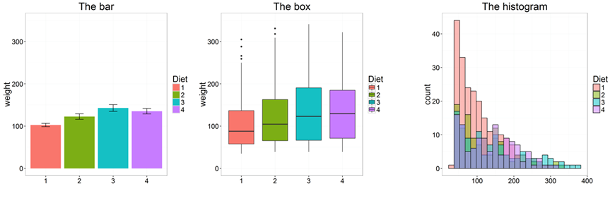
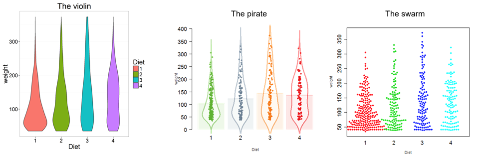
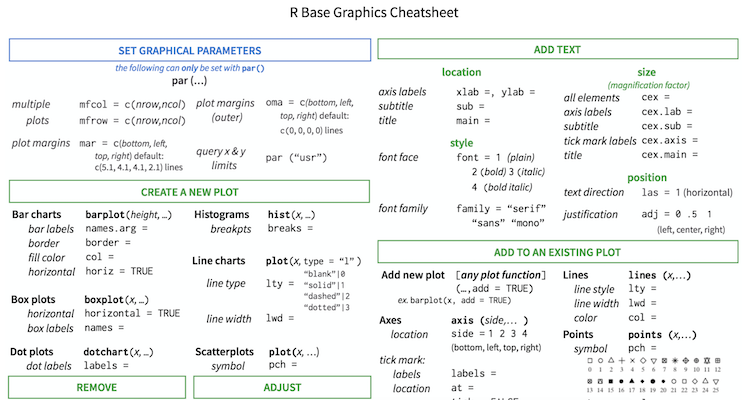

```{r xaringan-themer, include = FALSE}
library(xaringanthemer)
mono_light(
  base_color = "midnightblue",
  header_font_google = google_font("Josefin Sans"),
  text_font_google   = google_font("Montserrat", "500", "500i"),
  code_font_google   = google_font("Droid Mono"),
  link_color = "#8B1A1A", #firebrick4, "deepskyblue1"
  text_font_size = "28px"
)
```

## R base graphics

- `plot()` 			generic x-y plotting
- `barplot()` 	bar plots
- `boxplot()` 	box-and-whisker plot
- `hist()` 			histograms

.center[]

.small[ http://manuals.bioinformatics.ucr.edu/home/R_BioCondManual#TOC-Graphical-Procedures ]

---
## Basic plotting

R graphic regions

```{r echo=FALSE, fig.height=5}
par(oma=rep(3, 4), bg="grey80")     # permanent settings, oma: outer margin defined in line spaces
plot(c(0, 1), c(0, 1), type="n", ann=FALSE, axes=FALSE)
box("outer", col="grey")

par(xpd=TRUE)                       # set clipping to figure region   

rect(-1, -1, 2, 2, col="white")     # draw a large rectangle
box("figure")                       # set clipping back to plot region

par(xpd=FALSE)                      # draw a large rectangle
rect(-1, -1, 2, 2, col="cornsilk")
box("plot", lty="dashed")

text(.5, .5, "Plot Region")
mtext("Figure Region/Margin", side=3, line=2)
for (i in 1:4)   mtext(paste("Outer margin", i), side=i, line=1, outer=TRUE)
```

---
## R graphic regions

`par(mar=c(5.1, 4.1, 4.1, 2.1), mgp=c(3, 1, 0), las=0)`

- `par` sets or adjusts plotting parameters. Here we consider the following three parameters: margin size (`mar`), axis label locations (`mgp`), and axis label orientation (`las`)

.small[
- `mar` – A numeric vector of length 4, which sets the margin sizes in the following order: bottom, left, top, and right. The default is `c(5.1, 4.1, 4.1, 2.1)`

- `mgp` – A numeric vector of length 3, which sets the axis label locations relative to the edge of the inner plot window. The first value represents the location of the labels (i.e., xlab and ylab in plot), the second the tick-mark labels, and third the tick marks. The default is `c(3, 1, 0)`

- `las` – A numeric value indicating the orientation of the tick mark labels and any other text added to a plot after its initialization. The options are as follows: always parallel to the axis (the default, 0), always horizontal (1), always perpendicular to the axis (2), and always vertical (3)
]

.small[ http://rfunction.com/archives/1302 ]

---
# Save and restore graphic parameters

```{r fig.height=4}
old.par <- par("mar")
par(mar = c(1, 1, 1, 1))
plot(iris$Sepal.Length)
par(old.par)
```

---
# Multiple plots in one region

```{r fig.height=4}
par(mfrow = c(1, 2))
plot(iris$Sepal.Length)
plot(iris$Sepal.Width)
par(mfrow = c(1, 1))
```

---
## Some functions used in plot region

``` r
text() 
points() 
lines()
arrows()
box()
abline()
```

Some common plot settings

``` r
col: color of lines, text, ...
lwd: line width
lty: line type
font: font face (plain, bold, italic)
pch: type of plotting symbol
srt: string rotation
```

---
Plot examples

```{r fig.height=4}
data(cars)
# ?cars
plot(cars$dist) # if a single vector object is given to plot(), the values are plotted on the y-axis against the row numbers or index
# plot(cars) # bivariate scatterplot
# plot(cars$speed, type="o", col="blue") # graph cars using blue points overlayed by a line 
# plot(cars$dist,cars$speed, xlab="x axis", ylab="y axis", main="my plot", ylim=c(0,20), xlim=c(0,20), pch=15, col="blue") # Set a bunch of parameters
```

---
```{r fig.height=5}
x <- seq(0,20,by=2)
y <- seq(0,10,by=1)
plot(x,y,col="blue") 
# lines and points add graphics to the existing plot
lines(x,y,col="green",lty="dashed")

x2 <- c(0.5, 3, 5, 8, 12) 
y2 <- c(0.8, 1, 2, 4, 6) 
points(x2, y2, pch=16, col="green")
```

---
```{r fig.height=5}
# barplot(as.matrix(mtcars), main="Autos", ylab= "Total", beside=TRUE, col=rainbow(5))
# barplot(mtcars$cyl)
barplot(mtcars$cyl,col=rainbow(3))
```

---
```{r fig.height=5}
data(faithful)
attach(faithful)
hist(eruptions, main = "Old Faithful data", prob = T)
# hist(eruptions, main = "Old Faithful data", prob = T, breaks=18)

# boxplot(faithful)                      # same as boxplot(eruptions, waiting)
```

---
## Add legends to plots

```{r fig.height=5}
with(iris,
     plot(Sepal.Length, Sepal.Width, 
          pch=as.numeric(Species), cex=1.2,ylim=c(1,6)))
legend("topright", c("setosa", "versicolor", "virginica"), cex=1.5, pch=1:3)
```

---
## R base graphics

- `stats::heatmap()` - basic heatmap

Alternatives: 

- `gplots::heatmap.2()` - an extension of heatmap
- `heatmap3::heatmap3()` - another extension of heatmap
- `ComplexHeatmap::Heatmap()` - highly customizable, interactive heatmap

Other options:

- `pheatmap::pheatmap()` - grid-based heatmap
- `NMF::aheatmap()` - another grid-based heatmap

.small[	[ComplexHeatmap Complete Reference](https://jokergoo.github.io/ComplexHeatmap-reference/book/) by Zuguang Gu

https://bioconductor.org/packages/ComplexHeatmap/ ]

---
## Interactive heatmaps

- `d3heatmap::d3heatmap()` - interactive heatmap in d3

- `heatmaply::heatmaply()` - interactive heatmap with better dendrograms

- `plotly` - make ggplot2 plots interactive

.small[ [Heatmaps in R](https://channel9.msdn.com/Events/useR-international-R-User-conference/useR2016/Heatmaps-in-R-Overview-and-best-practices) 20 min video by Tal Galili

[Interactive plots in R](https://davetang.org/muse/2018/05/18/interactive-plots-in-r/) blog post by Dave Tang ]

---
## Special plots

- `vioplot()`: Violin plot
- `PiratePlot()`: violin plot enhanced 
- `beeswarm()`: The Bee Swarm Plot, an Alternative to Stripchart

.center[]

.small[ https://CRAN.R-project.org/package=vioplot 

[YaRrr! The Pirate’s Guide to R](https://bookdown.org/ndphillips/YaRrr/)

https://CRAN.R-project.org/package=beeswarm ]


---
## Saving plots

- Save to PDF

``` r
pdf("filename.pdf", width = 7, height = 5)
plot(1:10, 1:10)
dev.off()
```

- Other formats: `bmp()`, `jpg()`, `pdf()`, `png()`, or `tiff()`

- Click Export in the Plots window in RStudio

- Learn more `?Devices`

---
## R base graphic cheat-sheet

.center[]

.small[ https://github.com/nbrgraphs/mro/blob/master/BaseGraphicsCheatsheet.pdf ]

<!--
## Don't use barplots

.center[]

.small[ Weissgerber T et.al., "[Beyond Bar and Line Graphs: Time for a New Data Presentation Paradigm](http://journals.plos.org/plosbiology/article?id=10.1371/journal.pbio.1002128)", PLOS Biology,2015

https://cogtales.wordpress.com/2016/06/06/congratulations-barbarplots/ ]
-->
