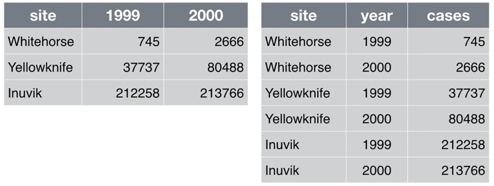

```{r xaringan-themer, include = FALSE}
library(xaringanthemer)
mono_light(
  base_color = "midnightblue",
  header_font_google = google_font("Josefin Sans"),
  text_font_google   = google_font("Montserrat", "500", "500i"),
  code_font_google   = google_font("Droid Mono"),
  link_color = "#8B1A1A", #firebrick4, "deepskyblue1"
  text_font_size = "28px",
  code_font_size = "26px"
)
```

## Tidyverse

.center[]

.small[ https://www.tidyverse.org/ 

https://education.rstudio.com/blog/2020/07/teaching-the-tidyverse-in-2020-part-1-getting-started/]

---
## Tidyverse

The `tidyverse` is a collection of packages based on [four principles](https://tidyverse.tidyverse.org/articles/manifesto.html) for handling data:

1. Reuse existing data structures
2. Compose simple functions with **the pipe %>%**
3. Embrace functional programming
4. Design for humans

The R project for Statistical Computing was built for a different age; the tidyverse is a collection of tools for *our* age

.small[ [The tidy tools manifesto](https://tidyverse.tidyverse.org/articles/manifesto.html) ]

---
## Tidyverse core packages

- **ggplot2** - data visualisation
- **dplyr** - data wrangling
- **readr** - reading data
- **tibble** - modern data frames
- **stringr** - string manipulation
- **forcats** - dealing with factors
- **tidyr** - data tidying
- **purrr** - functional programming

Each tidyverse package has a website at [PKGNAME].tidyverse.org, check https://ggplot2.tidyverse.org

.small[ https://www.tidyverse.org/packages/#core-tidyverse ]

---
class: center, middle

# Reading in data

---
## Base R functions for read-write the data

- `scan()` - Read data into a vector or list from the console or file

- `read.table()`, `read.csv()`, `read.delim()` - Reads a file in table format and creates a data frame from it, with cases corresponding to lines and variables to fields in the file

- `write.table()`, `write.csv()` - Saves the object (data.frame) to a file

- `?data.table::fread` for very fast data read into R

- "File -> Import Dataset" in RStudio

---
## readr

- There are some built-in functions for reading in data in text files. These functions are _read-dot-something_, for example, `read.csv()` reads in comma-delimited text data; `read.delim()` reads in tab-delimited text, etc. 

- `readr` package provides fast and intelligent data reading capabilities. Very similar looking functions, named _read-underscore-something_ -- e.g., `read_csv()`

- They're good at guessing the types of data in the columns, they don't do some of the other silly things that the base functions do

- Play nicely with `dplyr` - data manipulation package

.small[ http://readr.tidyverse.org/ ]

---
## tibbles

Data frames are great! Except for 

- printing them
- working with both characters and factors
- manipulating multiple columns
- ~~You need to remember to set `options(stringsAsFactors = FALSE)`~~ [Not needed from R v.4.0.0](https://stackoverflow.com/questions/61536155/r-4-0-0-and-stringsasfactors)
- If you want a one-collumn data frame, you need to use `dat[, "column1", drop = FALSE]`

tibbles are the data frame alternative simplifying work with data frame-like objects

.small[https://tibble.tidyverse.org/]

---
## tibbles

- A `tibble`, or `tbl_df`, is a modern reimagining of the `data.frame`, keeping what time has proven to be effective, and throwing out what is not

- Tibbles are `data.frames` that are lazy and surly: they do less (i.e., they don't change variable names or types, and don't do partial matching) and complain more (e.g., when a variable does not exist)

- This forces you to confront problems earlier, typically leading to cleaner, more expressive code. Tibbles also have an enhanced `print` method which makes them easier to use with large datasets containing complex objects
    - Hadley Wickham, Chief Scientist at RStudio 

- `glimpse()` into tibble, analog of `str()`

---
##  Making the data tidy with `tidyr`

- Principles of tidy data
    - Each _column_ is a _variable_
    - Each _row_ is an _observation_

.center[]

.small[ Tidy data paper, http://www.jstatsoft.org/v59/i10/paper ]

---
##  Making the data tidy with `tidyr`

- Principles of tidy data
    - Each _column_ is a _variable_
    - Each _row_ is an _observation_

.center[]

.small[ https://twitter.com/dataandme/status/1175010415341985793?s=20 ]

---
##  Making the data tidy with `tidyr`

- `tidyr` - flexible data reshaping
    - `pivot_longer()` -  "lengthens" data, increasing the number of rows and decreasing the number of columns
    - `pivot_wider()` - "widens" data, increasing the number of columns and decreasing the number of rows

Example of converting the wide data into tidy data

.center[]

.small[ https://tidyr.tidyverse.org/index.html, vignette("tidy-data"), vignette("pivot") ]


---
class: center, middle

# Data manipulation with dplyr

---
## Why not base R data subsetting?

- Bracket subsetting is useful but can be difficult to read

- Various ways of subsetting (by index, names, dollar sign) make interpretation less intuitive

---
## dplyr: data manipulation with R

80% of your work will be data preparation

- getting data (from databases, spreadsheets, flat-files)

- performing exploratory/diagnostic data analysis

- reshaping data

- visualizing data

---
## dplyr: data manipulation with R

80% of your work will be data preparation

- Filtering rows (to create a subset)

- Selecting columns of data (i.e., selecting variables)

- Adding new variables

- Sorting

- Aggregating 

- Joining

---
## dplyr: A grammar of data manipulation

- The `dplyr` package gives you a handful of useful **verbs** for managing data. On their own they don't do anything that base R can't do

- Basic `dplyr` verbs
    - `filter()`
    - `select()`
    - `mutate()`
    - `arrange()`
    - `summarize()`
    - `group_by()`

- They all take a data frame or tibble as their input for the first argument, and they all return a data frame or tibble as output

.small[ https://dplyr.tidyverse.org/ ]

---
## The pipe %>% operator

- Pipe `%>%` output of one command into an input of another command - chain commands together. (Think about the "|" operator in Linux)
- Imported from `magrittr` package
- Read as "then". Take the dataset (or object), _then_ do ...

```{r echo=TRUE, eval=TRUE, message=F, warning=F}
library(dplyr)
round( sqrt(1000), 3)
1000 %>% sqrt %>% round(., 3)
```

---
## The pipe %>% operator

- For example, we can view the head of the `diamonds` data.frame using either of the last two lines of code here:

```{R echo=TRUE, eval=TRUE, message=F, warning=F, results="hide"}
library(dplyr)
library(ggplot2)
data(diamonds)
# glimpse(diamonds)
diamonds %>% glimpse()
```

```{R echo=FALSE, eval=TRUE}
diamonds %>% head
```

---
## The pipe %>% operator

For example, read the last line of code as: "Take the `price` column of the `diamonds` data.frame and _then_ summarize it"
    
```{R echo=TRUE, eval=TRUE, message=F, warning=F, results="hide"}
library(dplyr)
data(diamonds)
head(diamonds)
diamonds %>% head
summary(diamonds$price)
diamonds$price %>% summary(object = .)
```

- (Ctrl/CMD)+SHIFT+M - a shortcut to insert the `%>%` sequence - you can see what it is by clicking the _Tools_ menu in RStudio, then selecting _Keyboard Shortcut Help_
- On Mac, it's CMD-SHIFT-M

---
## dplyr::filter()

If you want to filter **rows** of the data where some condition is true, use the `filter()` function. 

1. The first argument is the data frame you want to filter, e.g. `filter(mydata, ...`.
2. The second argument is a condition you must satisfy, e.g. `filter(ydat, symbol == "LEU1")`. If you want to satisfy *all* of multiple conditions, you can use the "and" operator, `&`. The "or" operator `|` (the pipe character, usually shift-backslash) will return a subset that meet *any* of the conditions.

- `==`: Equal to
- `!=`: Not equal to
- `>`, `>=`: Greater than, greater than or equal to
- `<`, `<=`: Less than, less than or equal to

---
## dplyr::filter()

For example, keep only the entries with Ideal cut

```{R echo=TRUE, eval=TRUE}
df.diamonds_ideal <- filter(diamonds, cut == "Ideal")
df.diamonds_ideal
```

---
## dplyr::filter()

We can achieve this same result using the `%>%` operator

```{R echo=TRUE, eval=FALSE}
diamonds %>% head
df.diamonds_ideal <- filter(diamonds, cut == "Ideal")
df.diamonds_ideal <- diamonds %>% filter(cut == "Ideal")
```

---
## dplyr::select()

- The `filter()` function allows you to return only certain _rows_ matching a condition. The `select()` function returns only certain _columns_. The first argument is the data, and subsequent arguments are the columns you want.
    - Syntax: `select(data, columns)`

```{R echo=TRUE, eval=FALSE}
df.diamonds_ideal %>% head
select(df.diamonds_ideal, carat, cut, color, price, clarity)
df.diamonds_ideal <- df.diamonds_ideal %>% select(., carat, cut, color, price, clarity)
```

---
## dplyr::mutate()

- The `mutate()` function adds new columns to the data that are functions of old columns

- It doesn't actually modify the data frame you're operating on, and the result is transient unless you assign it to a new object or reassign it back to itself (generally, not a good practice)
    - Syntax: `mutate(data, new_column = function(old_columns))`

```{R echo=TRUE, eval=FALSE}
df.diamonds_ideal %>% head
mutate(df.diamonds_ideal, price_per_carat = price/carat)
df.diamonds_ideal <- df.diamonds_ideal %>% mutate(price_per_carat = price/carat)
```

---
## dplyr::arrange()

- The `arrange()` function does what it sounds like - sorts things

- It takes a `data.frame` or `tbl_df` and arranges (or sorts) by column(s) of interest

- The first argument is the data, and subsequent arguments are columns to sort on. Use the `desc()` function to arrange by descending
    - Syntax: `arrange(data, column_to_sort_by)`

```{R echo=TRUE, eval=FALSE}
df.diamonds_ideal %>% head
arrange(df.diamonds_ideal, price)
df.diamonds_ideal %>% arrange(price, price_per_carat)
```

---
## dplyr::summarize()

- The `summarize()` function summarizes multiple values to a single value

- The power of `summarize()` comes from a few convenience functions called `n()` and `n_distinct()` that tell you the number of observations or the number of distinct values of a particular variable.
    - Syntax: `summarize(function_of_variables)`

```{R echo=TRUE, eval=FALSE}
summarize(df.diamonds_ideal, length = n(), avg_price = mean(price))
df.diamonds_ideal %>% summarize(length = n(), avg_price = mean(price))
```

---
## dplyr::group_by()

- Summarize *subsets of* columns by custom summary statistics

- Syntax: `group_by(data, column_to_group)`

```{R echo=TRUE, eval=FALSE}
group_by(diamonds, cut) %>% summarize(mean(price))
group_by(diamonds, cut, color) %>% summarize(mean(price))
```

---
## The power of pipe %>%

- Summarize *subsets of* columns by custom summary statistics

```{R echo=TRUE, eval=FALSE}
arrange(mutate(arrange(filter(tbl_df(diamonds), cut == "Ideal"), price),
  price_per_carat = price/carat), price_per_carat)
arrange(
  mutate(
    arrange(
      filter(tbl_df(diamonds), cut == "Ideal"), 
    price), 
  price_per_carat = price/carat), 
price_per_carat)
diamonds %>% filter(cut == "Ideal") %>% arrange(price) %>%
  mutate(price_per_carat = price/carat) %>% arrange(price_per_carat)
```

---
## Counting

- Count number of observations found for each factor or combination of factors

```{r}
diamonds %>% count(cut, sort = TRUE)
```

```{r}
diamonds %>% group_by(cut) %>% summarise(count = n()) %>% arrange(desc(count))
```


---
## Joining data frames

- `inner_join(x, y)`: Keep only rows where there are observations in both `x` and `y`
- `left_join(x, y)`: Keep all rows from `x`, whether they have a match in `y` or not (unmatched rows are filled with NAs)
- `right_join(x, y)`: Keep all rows from `y`, whether they have a match in `x` or not
- `full_join(x, y)`: Keep all rows from both `x` and `y`, whether they have a match in the other dataset or not

.small[ Review https://ready4r.netlify.app/labbook/part-5-doing-useful-things-with-multiple-tables.html#joining-tables ]

---
## Working with factors tidyverse way

`library(forcats)`

- `fct_rev()` - Reverse order of factor levels

- `fct_reorder()` - Reordering a factor by another variable

- `fct_collapse()` - Collapse multiple categories into one category

- `fct_lump()` - Collapsing the least/most frequent values of a factor into “other”

- `fct_infreq()` - Reordering a factor by the frequency of values

- `fct_relevel()` - Changing the order of a factor by hand

.small[ https://forcats.tidyverse.org/ ]

---
## But wait... There's more

- [tidymodels](https://www.tidymodels.org/start/) - a collection of packages for statistical inference, modeling and machine learning using tidyverse principles.

- [rvest](https://rvest.tidyverse.org) - scrape (or harvest) data from web pages.

- [dbplyr](https://dbplyr.tidyverse.org/articles/dbplyr.html) and [dtplyr](https://dtplyr.tidyverse.org/articles/translation.html) - two packages that provide interfaces for translations between dplyr and SQL and data.table code

---
## Useful links

[Data Transformation Cheat Sheet](https://github.com/rstudio/cheatsheets/raw/master/data-transformation.pdf) - dplyr grammar

- Teaching the Tidyverse in 2020, by Mine Çetinkaya-Rundel. [Part 1](https://education.rstudio.com/blog/2020/07/teaching-the-tidyverse-in-2020-part-1-getting-started/), [Part 3](https://education.rstudio.com/blog/2020/07/teaching-the-tidyverse-in-2020-part-3-data-wrangling-and-tidying/), [Part 4](https://education.rstudio.com/blog/2020/07/teaching-the-tidyverse-in-2020-part-4-when-to-purrr/)

- [Teaching the Tidyverse in 2021](https://www.tidyverse.org/blog/2021/08/teach-tidyverse-2021/), by Mine Çetinkaya-Rundel. 

- [Tidy Animated Verbs](https://www.garrickadenbuie.com/project/tidyexplain/)

- [Reshaping the data](https://uclouvain-cbio.github.io/WSBIM1207/sec-dplyr.html#reshaping-data)

---
## Next up

[Join](https://github.com/rstudio-education/remaster-the-tidyverse/tree/master/Data-Wrangling-With-The-Tidyverse/keynotes) from [Remaster the Tidyverse](https://github.com/rstudio-education/remaster-the-tidyverse) class materials built by Garrett Grolemund