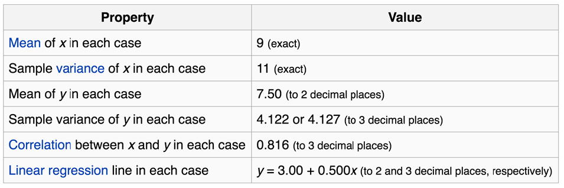
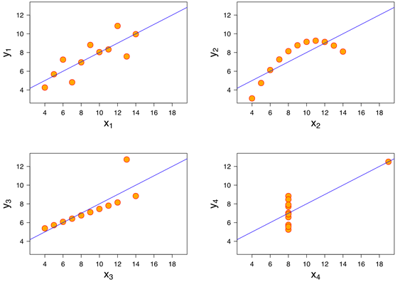

```{r xaringan-themer, include = FALSE}
library(xaringanthemer)
mono_light(
  base_color = "midnightblue",
  header_font_google = google_font("Josefin Sans"),
  text_font_google   = google_font("Montserrat", "500", "500i"),
  code_font_google   = google_font("Droid Mono"),
  link_color = "#8B1A1A", #firebrick4, "deepskyblue1"
  text_font_size = "28px",
  code_font_size = "26px"
)
```

```{r echo=FALSE, message=FALSE}
library(tidyverse)
```

## Why visualize data?

- Anscombe's quartet comprises four datasets that have nearly identical simple descriptive statistics, yet appear very different when graphed. (See Wikipedia link below)

- 11 observations (x, y) per group

.center[]

.small[ https://en.wikipedia.org/wiki/Anscombe%27s_quartet ]

---
## Why visualize data?

- Four groups

- 11 observations (x, y) per group

.center[]

.small[ https://en.wikipedia.org/wiki/Anscombe%27s_quartet ]

---
## Why visualized data?

.center[]

.small[ https://github.com/stephlocke/datasauRus ]

---
## Evolution of R graphics

- Base graphics

- Trellis plots
    - `lattice` package
    - Better design principles, choice of colors, symbol shapes, line styles
    - Known for distinct multi-panel layout

- ggplot2 package
    - Implements Grammar of Graphics, developed by Leland Wilkinson

---
class: inverse, center, middle

# ggplot2 - the grammar of graphics

---
## ggplot2 package

- `ggplot2` is a widely used R package that extends R's visualization capabilities. It takes the hassle out of things like creating legends, mapping other variables to scales like color, or faceting plots

- _Where does the "gg" in ggplot2 come from?_ The `ggplot2` package provides an R implementation of Leland Wilkinson's *Grammar of Graphics* (1999)
    - The *Grammar of Graphics* allows you to think beyond the garden variety plot types (e.g. scatterplot, barplot) and the consider the components that make up a plot or graphic, such as how data are represented on the plot (as lines, points, etc.), how variables are mapped to coordinates or plotting shape or color, what transformation or statistical summary is required, and so on

.small[ https://ggplot2.tidyverse.org/ ]

---
## The basics of ggplot2 graphics

Specifically, **ggplot2** allows you to build a plot layer-by-layer by specifying:

- **aesthetics** that map variables in the data to axes on the plot or to plotting size, shape, color, etc.,

- a **geom**, which specifies how the data are represented on the plot (points, lines, bars, etc.),

- a **stat**, a statistical transformation or summary of the data applied prior to plotting,

- **facets**, which we've already seen above, that allow the data to be divided into chunks on the basis of other categorical or continuous variables and the same plot drawn for each chunk.

---
## The basics of ggplot2 graphics

- Data mapped to graphical elements
- Add graphical layers and transformations
- Commands are chained with "+" sign

| Object     |       | Description                                                        |
|------------|-------|--------------------------------------------------------------------|
| Data       |       | The raw data that you want to plot                                 |
| Aethetics  | aes() | How to map your data on x, y axis, color, size, shape (aesthetics) |
| Geometries | geom_ | The geometric shapes that will represent the data                  |

``` text
data +   
aesthetic mappings of data to plot coordinates +  
geometry to represent the data
```

---
## Basic ggplot2 syntax

**Specify data, aesthetics and geometric shapes** 

`ggplot(data, aes(x=, y=, color=, shape=, size=, fill=)) +`   
`geom_point()`, or `geom_histogram()`, or `geom_boxplot()`, etc.   

- This combination is very effective for exploratory graphs. 

- The data must be a data frame in a **long** (not wide) format

- The `aes()` function maps **columns** of the data frame to aesthetic properties of geometric shapes to be plotted.

- `ggplot()` defines the plot; the `geoms` show the data; layers are added with `+` 

---
## Examples of ggplot2 graphics

``` r
diamonds %>% filter(cut == "Good", color == "E") %>% 
  ggplot(aes(x = price, y = carat)) +
  geom_point()  # aes(size = price) +
```

Try other geoms

``` r
  geom_smooth() # method = lm
  geom_line()
  geom_boxplot()
  geom_bar(stat="identity")
  geom_histogram()
```

---
## Moving beyond `ggplot` + `geoms`

Customizing scales

* Scales control the mapping from data to aesthetics and provide tools to read the plot (ie, axes and legends).

* Every aesthetic has a default scale. To add or modify a scale, use a `scale` function. 

* All scale functions have a common naming scheme:
`scale` `_` name of aesthetic `_` name of scale

* Examples: `scale_y_continuous`, `scale_color_discrete`, `scale_fill_manual`

.small[ [ggsci](https://CRAN.R-project.org/package=ggsci) R package and [Scientific Journal and Sci-Fi Themed
Color Palettes for ggplot2](https://cran.r-project.org/web/packages/ggsci/vignettes/ggsci.html) ]

---
## ggplot2 example - update scale for y-axis

```{r, message=FALSE, fig.height=5}
ggplot(iris, aes(x = Petal.Width, y = Sepal.Width, 
                 color=Species)) + geom_point() +
  scale_y_continuous(limits=c(0,5), breaks=seq(0,5,0.5))
```

---
## ggplot2 example - update scale for color

```{r, message=FALSE, fig.height=5}
ggplot(iris, aes(x = Petal.Width, y = Sepal.Width, 
                 color=Species)) + geom_point() +
  scale_color_manual(name="Iris Species", 
                     values=c("red","blue","black"))
```

---
## Split plots

* Sometimes, one needs to create separate plots of subsets of data. These are called facets in ggplot2. Think `par(mfrow=c(2,2))` analogy

* Use `facet_wrap()` if you want to facet by one variable and have `ggplot2` control the layout. Think 1D ribbon wrapped into 2D. Example:   
     + `facet_wrap( ~ var)`

- Use `facet_grid()` if you want to facet by one and/or two variables and control layout yourself. Think 2D grid. Examples:    
    + `facet_grid(. ~ var1)` - facets in columns   
    + `facet_grid(var1 ~ .)` - facets in rows   
    + `facet_grid(var1 ~ var2)` - facets in rows and columns   

---
## ggplot2 example - `facet_wrap` 

Note free x scales

```{r, message=FALSE, fig.height=4}
ggplot(iris, aes(x = Petal.Width, y = Sepal.Width)) + 
  geom_point() + geom_smooth(method="lm") +
  facet_wrap(~ Species, scales = "free_x")
```

---
## `gridExtra` R package for more custom plot arrangement

```{r message=FALSE, warning=FALSE, fig.height=4}
library(gridExtra)
p1 <- iris %>% filter(Species == "setosa") %>% ggplot(aes(x = Sepal.Length, y = Sepal.Width)) + geom_smooth()
p2 <- iris %>% filter(Species == "versicolor") %>% ggplot(aes(x = Sepal.Length, y = Sepal.Width)) + geom_smooth()
grid.arrange(p1, p2, ncol = 2)
```

---
## `patchwork` for simple plot arrangement

```{r message=FALSE, warning=FALSE, fig.height=4}
library(patchwork)
p1 <- iris %>% filter(Species == "setosa") %>% ggplot(aes(x = Sepal.Length, y = Sepal.Width)) + geom_smooth()
p2 <- iris %>% filter(Species == "versicolor") %>% ggplot(aes(x = Sepal.Length, y = Sepal.Width)) + geom_smooth()
p3 <- iris %>% filter(Species == "virginica") %>% ggplot(aes(x = Sepal.Length, y = Sepal.Width)) + geom_smooth()
p1 + p2 + p3
```

.small[ https://patchwork.data-imaginist.com/ ]

---
## `patchwork` for simple plot arrangement

```{r message=FALSE, warning=FALSE, fig.height=4}
library(patchwork)
p1 <- iris %>% filter(Species == "setosa") %>% ggplot(aes(x = Sepal.Length, y = Sepal.Width)) + geom_smooth()
p2 <- iris %>% filter(Species == "versicolor") %>% ggplot(aes(x = Sepal.Length, y = Sepal.Width)) + geom_smooth()
p3 <- iris %>% filter(Species == "virginica") %>% ggplot(aes(x = Sepal.Length, y = Sepal.Width)) + geom_smooth()
(p1 | p2) / p3
```

.small[ https://patchwork.data-imaginist.com/ ]

---
## stat functions

- All `geoms` perform a default statistical transformation. 

- For example, `geom_histogram()` bins the data before plotting. `geom_smooth()` fits a line through the data according to a specified method.

- In some cases the transformation is the "identity", which just means plot the raw data. For example, `geom_point()`

- These transformations are done by `stat` functions. The naming scheme is `stat_` followed by the name of the transformation. For example, `stat_bin`, `stat_smooth`, `stat_boxplot`

- **Every geom has a default stat, every stat has a default geom.**

---
## Example of `stat="identity"`

```{r fig.height=4}
# ToothGrowth describes the effect of Vitamin C on Tooth growth in Guinea pigs
df <- data.frame(dose = c("D0.5", "D1", "D2"),
                  len = c(4.2, 10, 29.5))
ggplot(data=df, aes(x=dose, y=len)) +
  geom_bar(stat="identity")
```

---
## Rotating plots

```{r fig.height=4}
# Horizontal bar plot
ggplot(data=df, aes(x=dose, y=len)) +
  geom_bar(stat="identity") +
  coord_flip()
```

.small[ [ggplot2 barplots : Quick start guide - R software and data visualization](http://www.sthda.com/english/wiki/ggplot2-barplots-quick-start-guide-r-software-and-data-visualization) ]

---
## Update themes and labels

* The default ggplot2 theme is excellent. It follows the advice of several landmark papers regarding statistics and visual perception. (Wickham 2009, p. 141)

* However you can change the theme using ggplot2's themeing system. To date, there are seven built-in themes: `theme_gray` (_default_), `theme_bw`, `theme_linedraw`, `theme_light`, `theme_dark`, `theme_minimal`, `theme_classic`

* Explore the `cowplot` R package by Claus Wilke, and its themes `theme_cowplot()`, `theme_half_open()`, `theme_minimal_grid()`, etc.

* You can also update axis labels and titles using the `labs` function

.small[https://wilkelab.org/cowplot/index.html]

---
## ggplot2 example - update labels

```{r, message=FALSE, fig.height=4}
ggplot(iris, aes(x = Petal.Width, y = Sepal.Width, 
                 color=Species)) + geom_point() +
  labs(title="Sepal vs. Petal", 
       x="Petal Width (cm)", y="Sepal Width (cm)") 
```

---
## ggplot2 example - change theme

```{r, message=FALSE, fig.height=4}
ggplot(iris, aes(x = Petal.Width, y = Sepal.Width, 
                 shape=Species)) + geom_point() +
  theme_bw()
```

---
## `cowplot` - publication-quality plots

```{r, message=FALSE, fig.height=4}
library(cowplot)
ggplot(iris, aes(x = Petal.Width, y = Sepal.Width, 
                 shape=Species, color = Species)) + geom_point() +
  theme_cowplot()
```

.small[ https://cran.r-project.org/web/packages/cowplot/vignettes/introduction.html ]

---
## `cowplot` - publication-quality plots

```{r, message=FALSE, fig.height=4}
library(cowplot)
ggplot(iris, aes(x = Petal.Width, y = Sepal.Width, 
                 shape=Species, color = Species)) + geom_point() +
  theme_minimal_grid()
```

.small[ https://cran.r-project.org/web/packages/cowplot/vignettes/introduction.html ]

---
## `cowplot` - publication-quality plots

```{r, message=FALSE, fig.height=4}
library(cowplot)
p1 <- ggplot(mtcars, aes(disp, mpg)) + geom_point()
p2 <- ggplot(mtcars, aes(qsec, mpg)) + geom_point()

plot_grid(p1, p2, labels = c('A', 'B'), label_size = 12)
```

---
## Barplot

```{r fig.height=4}
data(mpg)
ggplot(mpg, aes(x = class)) + geom_bar()
```

.small[ https://cran.r-project.org/web/packages/cowplot/vignettes/introduction.html ]

---
## Barplot

```{r fig.height=4}
class_agg <- data.frame(table(mpg$class))
names(class_agg) <- c("class", "count")
ggplot(class_agg, aes(x = class, y = count)) + 
  geom_bar(aes(fill = class), stat = "identity")
```

---
## Horizontal Barplot

```{r fig.height=4}
class_agg <- data.frame(table(mpg$class))
names(class_agg) <- c("class", "count")
ggplot(class_agg, aes(x = count, y = class)) + 
  geom_bar(aes(fill = class), stat = "identity")
```

Map data directly to the proper axes. Previously, `coord_flip()` was used.

---
## Reorder levels using forcats

```{r fig.height=4}
library(forcats)
class_agg <- data.frame(table(mpg$class))
names(class_agg) <- c("class", "count")

ggplot(class_agg, aes(x = count, y = fct_reorder(class, count))) + 
  geom_bar(aes(fill = class), stat = "identity")
```

.small[ https://forcats.tidyverse.org/reference/index.html ]

---
## Density plot

```{r fig.height=4}
ggplot(mpg, aes(x = hwy)) + geom_density()
```

---
## Histogram

```{r fig.height=4}
ggplot(mpg, aes(x = hwy)) +
  geom_histogram() +
  geom_density(aes(y=2 * ..count..))
```

---
## Stacked histogram

```{r fig.height=4}
ggplot(mpg, aes(x = hwy, fill = class)) + geom_histogram(position = "stack")
```

---
## Side-by-side histogram

```{r fig.height=4}
ggplot(mpg, aes(x = hwy, fill = class)) + geom_histogram(position = "dodge")
```

---
## Proportions

```{r fig.height=4}
# useful for assessing percentages
ggplot(mpg, aes(x = hwy, fill = class)) + geom_histogram(position = "fill")
```


---
## Smoothing

```{r fig.height=4}
ggplot(iris, aes(x = Sepal.Width, y = Petal.Width)) +
  geom_smooth() +
  geom_smooth(method = "lm", color = "seagreen", se=FALSE)
```

---
## Additional aesthetic mapping

```{r fig.height=4}
ggplot(iris, aes(x = Sepal.Width, y = Petal.Width)) +
  geom_point(aes(color = Species))
```

---
## Summary: Fine tuning ggplot2 graphics

| Parameter                   |        | Description                                                                                                                     | 
|-----------------------------|--------|---------------------------------------------------------------------------------------------------------------------------------| 
| Facets                      | facet_ | Split one plot into multiple plots based on a grouping variable                                                                 | 
| Scales                      | scale_ | Maps between the data ranges and the dimensions of the plot                                                                     | 
| Visual Themes               | theme  | The overall visual defaults of a plot: background, grids, axe, default typeface, sizes, colors, etc.                            | 
| Statistical transformations | stat_  | Statistical summaries of the data that can be plotted, such as quantiles, fitted curves (loess, linear models, etc.), sums etc. | 
| Coordinate systems          | coord_ | Expressing coordinates in a system other than Cartesian                                                                         | 

---
## Putting it all together

```{R echo=TRUE, eval=FALSE}
diamonds %>%                 # Start with the 'diamonds' dataset
  filter(cut == "Ideal") %>% # Then, filter rows where cut == Ideal
  ggplot(aes(price)) +       # Then, plot using ggplot
  geom_histogram() +         # and plot histograms
  facet_wrap(~ color) +      # in a 'small multiple' plot, broken out by 'color' 
  ggtitle("Diamond price distribution per color") +
  labs(x="Price", y="Count") +
  theme(panel.background = element_rect(fill="lightblue")) +
  theme(plot.title = element_text(family="Trebuchet MS", size=28, face="bold", hjust=0, color="#777777")) +
  theme(axis.title.y = element_text(angle=0)) +
  theme(panel.grid.minor = element_blank())
```

---
## Saving ggplot2 plots

- `pdf()` (or any other graphical device, e.g., `jpeg`, `png`, `svg`) and `dev.off()` works

- `ggsave()` saves the ggplot object (or, the latest plot) into a file. File extension defines the graphical device

``` r
p <- ggplot(mpg, aes(x = class)) + geom_bar()
ggsave(filename = "test.jpg", plot = p, width = 7, height = 10, units = c("in"), dpi = 300)
```

---
## Plotly - interactive ggplots. plot.ly/ggplot2/

```{r fig.height=3.5}
suppressMessages(library(plotly))
p <- ggplot(iris, aes(x = Sepal.Width, y = Petal.Width)) + geom_point(aes(color = Species))
pp <- ggplotly(p)
pp
# Save with 
# htmlwidgets::saveWidget(pp, "test_plotly.html")
```

.small[ [Plotly](https://geanders.github.io/RProgrammingForResearch/reporting-data-results-3.html#htmlwidgets) ]

---
## Interactive heatmaps

```{r warning=FALSE, fig.height=4}
# BiocManager::install("talgalili/heatmaply")
suppressMessages(library(heatmaply))
suppressMessages(library(RColorBrewer))
heatmaply(scale(mtcars), colors = colorRampPalette(rev(brewer.pal(n = 7, name = "RdYlBu")))(100))
```

.small[ https://github.com/talgalili/heatmaply ]
---
## ggplots in a loop

```{r fig.height=4.5}
p1 <- ggplot(mtcars, aes(disp, mpg)) + geom_point()
p2 <- ggplot(mtcars, aes(qsec, mpg)) + geom_point()
x <- list(p1, p2)
lapply(x, print)
# for (i in 1:length(x)) {
#   print(x[i])
# }
```


---
## Graphic editors

- **Inkscape** - vector graphics editor. Works with Scalable Vector Graphics (SVG) format. Export in any format, at any resolution.
    - Note `svg` graphic device in R. `ggsave()` also saves graphs in `svg` format

- **GIMP** - raster graphics editor. Think Photoshop.

.small[ https://inkscape.org/

https://www.gimp.org/

[INKSCAPE VS. GIMP – WHICH ONE SHOULD YOU USE?](https://daviesmediadesign.com/inkscape-vs-gimp-which-one-should-you-use/)
]

---
## But wait... There's more

- [gganimate](https://gganimate.com) - animated ggplots
- [ggridges](https://wilkelab.org/ggridges/) - ridgeline plots
- [ggrepel](https://ggrepel.slowkow.com) - nonoverlapping text labels
- [GGally](https://ggobi.github.io/ggally/) - ggplot2 extension with pairwise plot, scatterplot, parallel coordinates plot, survival plot, network plots, and more.
- [Awesome ggplot2](https://github.com/erikgahner/awesome-ggplot2)

