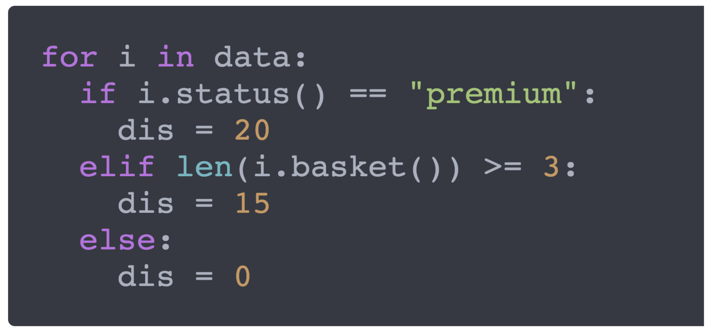
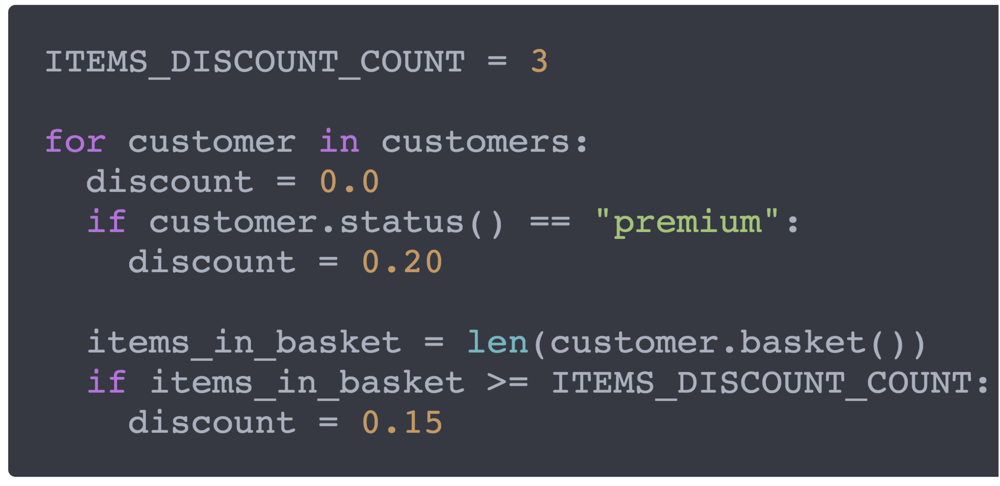
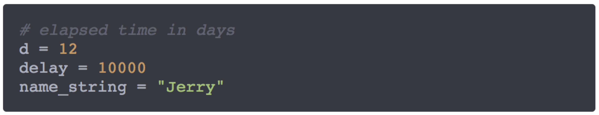
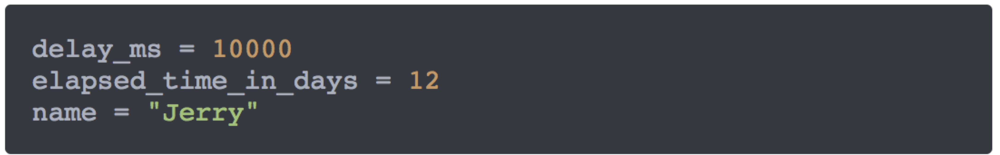
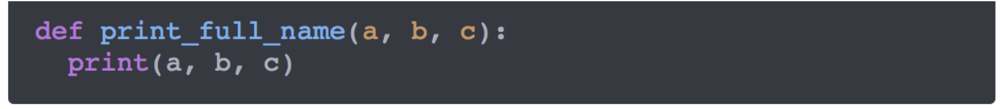
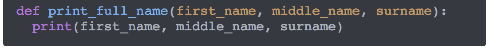

```{r xaringan-themer, include = FALSE}
library(xaringanthemer)
mono_light(
  base_color = "midnightblue",
  header_font_google = google_font("Josefin Sans"),
  text_font_google   = google_font("Montserrat", "500", "500i"),
  code_font_google   = google_font("Droid Mono"),
  link_color = "#8B1A1A", #firebrick4, "deepskyblue1"
  text_font_size = "28px",
  code_font_size = "26px"
)
```

## Automating everything

- Little automation is better than no automation
- It's more work to do things properly, but it could save you a ton of aggravation down the road

What to automate?

- what you're trying to do
- what you're thinking about
- what you're seeing
- what you're concluding and why

---
## Good vs. bad programming

.center[]
<!-- Any fool can write code that a computer can understand. Good programmers write code that humans can understand.
— Martin Fowler -->

- Bad programmer explains him/herself with comments
- Good programmer explains him/herself with code 

---
## Good code = Clean code

Follow coding conventions

- [PEP-8](https://www.python.org/dev/peps/pep-0008/) for Python, [PSR-2](http://www.php-fig.org/psr/psr-2/) for PHP, google "[language_name] coding conventions" for more

- [Google's R Style Guide](https://google.github.io/styleguide/Rguide.html), [R style guide](http://adv-r.had.co.nz/Style.html) by Hadley Wickham

Clean code is

- Understandable at first glance
- Neat and elegant
- Unambigious
- Not necesserily computationally efficient
- Self-explanatory
- Maintainable

---
## Bad code

- Full of “magic” – variables/values noone can understand
- Cluttered, or too loose
- Redundant
- Poorly commented
- Does not follow conventions
- Hardly maintainable

**Code represents you – don’t write a bad code**

---
## Good vs. Bad code

Is this a good  code?

```{r eval=FALSE}
j <- 4
for (i in data) {
  if (i == "premium") {
    dis <- 20
  } else if (j >= 3) {
    dis <- 15
  } else {
    dis <- 0
  }
}
```


<!--.center[]
Bad code-->

---
## Good vs. Bad code

Is this a good  code?

```{r eval=FALSE}
Number_Of_Items_In_Basket <- 4
for (Customer_Status in Customer_Records) {
  if (Customer_Status == "premium") {
    Discount <- 20
  } else if (Number_Of_Items_In_Basket >= 3) {
    Discount <- 15
  } else {
    Discount <- 0
  }
}
```

<!--.center[]
Good code-->

---
## Good variable names

Variable names – nouns

- informative
- unambigious
- descriptive
- variables are in lower case, constants are in UPPER case

---
## Good variable names

- **Tab completion** - Almost all modern text editors provide tab completion, so that typing the first part of a variable name and then pressing the tab key inserts the completed name of the variable. Employing this means that meaningful, longer variable names are no harder to type than terse abbreviations

- Choose and follow conventions
    - **underscore_convention**
    - **camelCaseConvention**
    - **dot.convention**

.small[https://www.chaseadams.io/posts/most-common-programming-case-types/]

---
## Good vs. bad variable names

.center[]
<!--Bad variable names-->

---
## Good vs. bad variable names

.center[]
<!--Good variable names-->

---
## Good function names

- Function names – verbs
    - “verb first” rule, e.g., `print_full_name`
    - informative, unambigious, descriptive, etc., as for variables

.center[]

.center[]

---
## Good naming practices

- Short but meaningful
- Don’t use spaces, either in variable names or file names, use underscore "_" or dot "." instead, e.g., "tcga_first_batch"
- Avoid leading and trailing spaces within cells, e.g., " pass" or "pass "
- Avoid special characters, except for underscores and hyphens. Other symbols ($, @, %, #, &, *, (, ), !, /, etc.) often have special meaning in programming languages, and so they can be harder to handle

.small[

| good name        | good alternative  | avoid             |
|------------------|-------------------|-------------------|
| Max_temp_C       | MaxTemp           | Maximum Temp (◦C) |
| Precipitation_mm | Precipitation     | precmm            |
| Mean_year_growth | MeanYearGrowth    | Mean growth/year  |
| sex              | sex               | M/F               |
| weight           | weight            | w.                |
| cell_type        | CellType          | Cell type         |
| Observation_01   | first_observation | 1st Obs.          |

]

---
## Refactoring

Refactoring – making better code

- Make code understandable by other developers. Here we ask ourselves a question; If I would give the code to my grandma, would she understand it?

- Increase readability of the code = reduce cluttering of the code. Make code loose in tight places and tight in loose places

- **Globally search-and-replace bad variable/function names**

---
## Code formatting

- **formatR** - Provides a function `tidy_source()` to format R source code. Spaces and indent will be added to the code automatically, and comments will be preserved under certain conditions, so that R code will be more human-readable and tidy. There is also a Shiny app as a user interface in this package (see `tidy_app()`).

- **styler** - Non-Invasive Pretty Printing of R Code. Pretty-prints R code without changing the user's formatting intent. `style_file()` or `style_dir()` functions will automatically format R files.

.small[https://CRAN.R-project.org/package=formatR

https://CRAN.R-project.org/package=styler]

---
## Computational reproducibility in plain language

- **Write code that uses relative paths.**
    - Don't use hard-coded absolute paths (i.e. `/Users/stephen/Data/seq-data.csv` or `C:\Stephen\Documents\Data\Project1\data.txt`)
    - Instead, define a variable, e.g., `data_dir` with the full path to the project's folder and use `file.path()` to append it to the relative paths
    
```{r eval=FALSE}
data_dir <- "/Users/stephen/Project/"
fileNameIn1 <- file.path(data_dir, "seq-data.csv")
read.table(fileNameIn1)
```

---
## Computational reproducibility in plain language

- **Document everything and use code as documentation.**
    - Document why you do something, not mechanics
    - Document your methods and workflows
    - Document the origin of all data in your project directory
    - Document **when** and **how** you downloaded the data
    - Record **data** version info
    - Record **software** version info with `session_info()`

- **Always set your seed.** If you're doing anything that involves random/monte-carlo approaches, always use `set.seed()`.

<!--
## Principles of good code development

- **DRY**
    - Don't Repeat Yourself
    - Do everything to avoid code repetition!

- **WET**
    - Write Everything (more than) Twice
    - The first time you write a code, you are writing it for the solution, second for comprehension, third for efficiency and last for your sake

- **KISS**
    - Keep It Small and Simple
    - Simplicity over complicity, shorter over longer


## Summary of good software development practices

1. Place a brief explanatory comment at the start of every program
2. Decompose programs into functions
3. Be ruthless about eliminating duplication
4. Always search for well-maintained software that do what you need
5. Test libraries before relying on them
6. Give functions and variables meaningful names
7. Make dependencies and requirements explicit
8. Do not comment and uncomment sections of code to control a program’s behavior
9. Provide a simple example or test dataset
10. Submit code to a reputable DOI-issuing repository

The core realization in these practices is that being readable, reusable, and testable are all side effects of writing modular code, i.e., of building programs out of short, single-purpose functions with clearly-defined inputs and outputs 


## Ensure long-time usability and stability

1. Host software and resources on archivally stable services
2. Provide easy-to-use installation interface
3. Take care of all the dependencies the tool needs
4. Provide an example dataset
5. Provide a ‘Quick Start’ guide
6. Choose an adequate name
7. Assume no root privileges
8. Create agnostic installation platform or distribute different versions for each platform

.small[ Mangul, Serghei, Thiago Mosqueiro, Dat Duong, Keith Mitchell, Varuni Sarwal, Brian Hill, Jaqueline Brito, et al. “[A Comprehensive Analysis of the Usability and Archival Stability of Omics Computational Tools and Resources](https://doi.org/10.1101/452532),” October 25, 2018.]
-->

---
## References 

- [Mastering Software Development in R](https://bookdown.org/rdpeng/RProgDA/), book by Roger Peng

- [Software Carpentry reading material on software engineering and scientific computing](http://software-carpentry.org/reading/) 

- [Software development skills for data scientists](http://treycausey.com/software_dev_skills.html) by Trey Causey

- Seemann, Torsten. “[Ten Recommendations for Creating Usable Bioinformatics Command Line Software](https://doi.org/10.1186/2047-217X-2-15).” GigaScience 2, no. 1 (December 2013)

- List, Markus, Peter Ebert, and Felipe Albrecht. “[Ten Simple Rules for Developing Usable Software in Computational Biology](https://doi.org/10.1371/journal.pcbi.1005265).” PLoS Computational Biology 13, no. 1 (January 2017)

- Taschuk, Morgan, and Greg Wilson. “[Ten Simple Rules for Making Research Software More Robust](https://doi.org/10.1371/journal.pcbi.1005412).” PLOS Computational Biology 13, no. 4 (April 13, 2017). [GitHub](https://github.com/oicr-gsi/robust-paper) 
