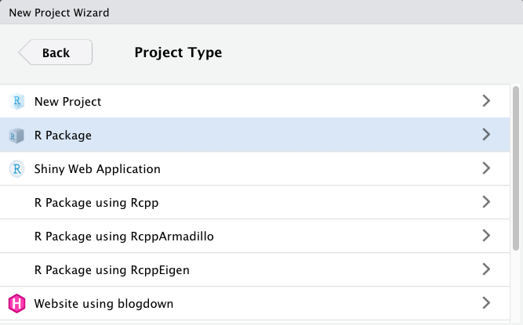
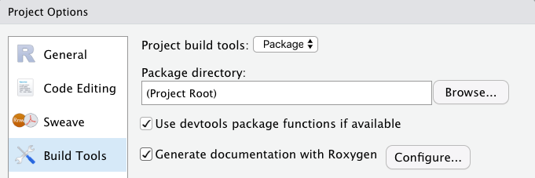

```{r xaringan-themer, include = FALSE}
library(xaringanthemer)
mono_light(
  base_color = "midnightblue",
  header_font_google = google_font("Josefin Sans"),
  text_font_google   = google_font("Montserrat", "500", "500i"),
  code_font_google   = google_font("Droid Mono"),
  link_color = "#8B1A1A", #firebrick4, "deepskyblue1"
  text_font_size = "28px",
  code_font_size = "26px"
)
```

```{r setup, include=FALSE}
knitr::opts_chunk$set(echo = TRUE,
                      size = "footnotesize",
                      error=TRUE,
                      fig.align="center")
library(ggplot2)
library(tidyverse)
library(magrittr)
library(gapminder)
```

## Do One Thing and Do It Well

- Functions are minimal bits of repeated code that do one thing well

- Should be universal – applied to a variety of problems

- Scalability – should handle small and large tasks equally well

``` r
fahrenheit_to_celsius <- function(temp_F) {
  temp_C <- (temp_F - 32) * 5 / 9
  return(temp_C)
}
```
.small[https://swcarpentry.github.io/r-novice-inflammation/02-func-R/]

---
## Writing your functions	

- Each function better be in a separate file, e.g., `temperature.R`

- Should contain code and documentation

- In a package, placed in the `R` subfolder

``` r
fahrenheit_to_celsius <- function(temp_F) {
  temp_C <- (temp_F - 32) * 5 / 9
  return(temp_C)
}
```
.small[https://swcarpentry.github.io/r-novice-inflammation/02-func-R/]

---
## Functions

Functions are created using the `function()` directive

``` r
f <- function(<arguments>) {
# Do something interesting
# Return the result 
}
```

The return value of a function is the last expression in the function body to be evaluated

---
## Arguments

- Functions have named arguments

- Arguments may have default values, be required, optional, or missing

- Arguments can be set by name, the order is not important
``` r
sd(x = mtx, na.rm = TRUE) # Equivalent to sd(na.rm = TRUE, x = mtx)
```

- Arguments can be matched positionally
``` r
sd(mtx, TRUE) # But changing order won't work. sd(TRUE, mtx) - wrong
```

- Always use the default order. Using names is recommended for clarity. Mix and match OK

---
## Message throughout the function

- `message("message")` will output “message” upon running unless `suppressMessages` is set to TRUE

- `warning("warning")` will output a warning with the message “warning” upon running unless `suppressWarnings` is set to TRUE

- `stop("error")` will terminate execution of a function and provide the message “error” upon exit. If the function is part of a larger script, will terminate running the entire script

---
## Recursive function: factorial

```{r}
fact1 <- function(x) {
if (x==1) return(1) else return(x*fact1(x-1)) 
}
fact2 <- function(x) { prod(1:x) }
fact3 <- function(x) { gamma(x+1) }
```

---
## Recursive function: factorial

```{r}
system.time(for (i in 1:1e4) fact1(100))
system.time(for (i in 1:1e4) fact2(100))
system.time(for (i in 1:1e4) fact3(100))
```

---
## Recursive function: Fibonacci numbers

```{r}
fibR <- function(n) {
 if (n == 0) return(0)
 if (n == 1) return(1)
return (fibR(n - 1) + fibR(n - 2)) }
```

```{r eval=FALSE, echo=FALSE}
fibonacci <- local({  #local evaluates an expression in a local environment
 memo <- c(1, 1, rep(NA, 100))
 
 f <- function(x) {
  if(x == 0) return(0)
  if(x < 0) return(NA)
  if(x > length(memo)) stop("`x' too big for implementation")
  if(!is.na(memo[x])) return(memo[x])
  ans <- f(x-2) + f(x-1)
  memo[x] <<- ans
  ans 
  }
})

fibonacci2 <- function(n) {
 if (n == 0) return(0)
 if (n == 1) return(1)
 if (n == 2) return(1)
 x=vector("integer",n)
 x[1:2] <- 1
 for (i in 3:n) x[i]=x[i-1]+x[i-2]
 x[n]
}
```

---
class: inverse, center, middle

# Packages

---
## DRY, don't repeat yourself

- If you're repeating the same lines of code in multiple places, you should turn those minimal repetitive tasks into functions – reuse your code

- A package is a collection of frequently used functions

- Package = easiest way to distribute code and data

- Package = easiest way to reuse other’s code

---
## Starting an R package using RStudio

Ideally, create packages from scratch as soon as you begin on a project

- RStudio -> File -> New project -> New Directory -> R Package

.center[]

---
## Package made simple with usethis

`usethis` is a workflow package: it automates repetitive tasks that arise during project setup and development, both for R packages and non-package projects

``` r
library(usethis)

# Create a new package
path <- file.path(tempdir(), "mypkg")
create_package(path)
```

Most functions start with `use_*()` (e.g., `use_vignette()`, `use_mit_license()`)

.small[https://usethis.r-lib.org/]

---
## Starting an R package: `DESCRIPTION`

- `usethis::create_package()` will create package's skeleton and the DESCRIPTION file

- Edit the `DESCRIPTION` file
    - Adjust _Title_, _Author_ and _role_, _Description_ (as verbose as you can)
    - Add license (`usethis::use_mit_license()` and similar functions)

.small[http://r-pkgs.had.co.nz/description.html]

---
## Starting an R package: `DESCRIPTION`

- If some of your functions use functions from other packages, you should add `imports` (forced install) and/or `suggests` (suggested install) sections to the `DESCRIPTION` file

``` r
usethis::use_package("dplyr") # Adding dplyr to Imports
usethis::use_package("dplyr", type = "Suggests") # Adding dplyr to Suggests
```

- Functions from packages declared in the `DESCRIPTION` file should be used with the `::` sign, e.g., `dplyr::left_join()`

.small[http://r-pkgs.had.co.nz/description.html]

---
## Starting an R package: `DESCRIPTION`

Short-term: Keeps track of imports (dependencies)

Long-term: Help others find your package

``` r
Package: examplepackage
Type: Package
Title: What the Package Does (Title Case)
Version: 0.1.0
Authors@R: person("First", "Last", email = "first.last@example.com",
                  role = c("aut", "cre"))
Description: More about what it does (maybe more than one line)
    Use four spaces when indenting paragraphs within the Description.
Depends: R (>= 4.0.0)
License: What license is it under?
Encoding: UTF-8
LazyData: true
```

---
## Writing your first function

Create a file `cat_function.R` with the following content

``` r
cat_function <- function(love.cats = TRUE){
  if(love.cats == TRUE){
    print("I love cats!")
  }
  else {
    print("I will love cats!")
  }
}
```

---
## Package priorities

**Question: What is more important?**

- Usability, solves real problem
- Statistical (methodological) superiority
- Documentation
- Speed

---
## Package priorities

**Question: What is more important?**

- Usability, solves real problem
- Statistical (methodological) superiority
- **Documentation**
- Speed

---
## Documenting functions: the old way

- Originally, documentation was written in LaTeX-like format, stored in `man/*.Rd` files

``` latex
\name{cat_function}
\alias{cat_function}
\title{A Cat Function}
\usage{
cat_function(love.cats = TRUE)
}
\arguments{
\item{love.cats}{Do you love cats? Defaults to TRUE.}
}
\description{
This function allows you to express your love of cats.
}
\examples{
cat_function()
}
\keyword{cats}
```

---
## Documenting functions: the simple way

- The package `roxygen2` greatly simplifies documentation
- Roxygen2 docstrings start with #’
- Keywords defining pieces of documentation start with @
    - `@param` - parameter description
    - `@return` - what the function returns
    - `@export` - must be to make the function available
    - `@examples` - how-to use the function

- Can (must) use LaTeX syntax in special cases
    - `\code{ <R code here> }` - code highlight
    - `\url{ http:// ... }` - URL
    - `\email{name@...}` - e-mail

.small[https://CRAN.R-project.org/package=roxygen2]

---
## Documenting functions: the simple way

- The package `roxygen2` greatly simplifies documentation

``` r
#' A Cat Function
#'
#' This function allows you to express your love of cats.
#' @param love.cats Do you love cats? Defaults to TRUE.
#' @keywords cats
#' @export
#' @examples
#' cat_function()
```

---
## Generating documentation

- Run `roxygen2::roxygenise()` or `devtools::document()` to convert roxygen-formatted help to `.Rd` files understood by R

- Check `Generate documentation with Roxygen` to auto-generate `.Rd` files, NAMESPACE file. The menu "Tools -> Project Options -> Build Tools"

.center[  ]

.small[https://usethis.r-lib.org/]

---
## Making your functions available

- All packages have a `NAMESPACE` file: a collection of objects to be exported and imported
    - To avoid overwriting users' variables
    - To avoid ambiguity in function calls
    - To ensure the package has everything it needs to run
    - To encourage modular code

``` r
# Generated by roxygen2: do not edit by hand

S3method(t,test2)
export(TCGA_corr)
export(Venn2)
export(Venn3)
export(Venn4)
export(Venn5)
export(gene_enrichment)
```

---
## Making your functions available

- A `NAMESPACE` file specifies which functions are available to the user, and which are hidden (helper functions, minimize naming conflicts)

``` r
export(function_name)
```

- A minimal `NAMESPACE` file

``` r
# Export all names
exportPattern(".")
```

- Your `NAMESPACE` is auto generated using `@export`, `@import`, `@importFrom` Roxygen *tags*; never directly modify your `NAMESPACE` file

---
## Making objects from other packages available

- All or partial set of objects from another package can be imported and used as `package::object`

``` r
import(randomForest)
importFrom(ModelMetrics,mcc)
importFrom(PRROC,pr.curve)
```

- Your `NAMESPACE` is auto generated using `@export`, `@import`, `importFrom` Roxygen *tags*; never directly modify your `NAMESPACE` file

---
## Making everything available with Roxygen2

Roxygen tags from function's help sections get converted to the NAMESPACE entries

In `preciseTAD.R` function:
```
#' @export
#'
#' @import randomForest e1071
preciseTAD <- function(...)
```

In NAMESPACE, after running `roxygen2::roxygenise()` or `devtools::document()`
```
export(preciseTAD)
import(randomForest)
import(e1071)
```

---
## Writing detailed documentation

- **Vignette** – an instructive tutorial demonstrating practical uses of the software with discussion of the interpretation of the results (vignette = tutorial). Critical to get a user started with your package

- A short introduction that explains
    - The type of data the package can be used on
    - The general purpose of the functions in the package
    - One or more example analyses with
    - A small, real data set
    - An explanation of the key functions
    - An application of these functions to the data
    - A description of the output and how it can be used

.small[ https://github.com/hadley/dplyr/tree/master/vignettes ]

---
## Writing vignettes

- Written using Markdown syntax
- Saved in `vignettes/*.Rmd` files
- Add YAML header to each vignette file

``` yaml
---
title: "Vignette title"
date: "`r Sys.Date()`"
output: rmarkdown::html_vignette
vignette: >
  %\VignetteIndexEntry{Vignette title}
  %\VignetteEngine{knitr::rmarkdown}
  %\VignetteEncoding{UTF-8}
---
```

- Build your vignettes with the `devtools::build_vignettes()` command
- The resulting `*.html` files will be in the `inst/doc` folder

---
## Package building pipeline using devtools

``` r
library(devtools)
create(“cats”) # Create package skeleton
document(“cats”) # Create function's help
build_vignettes("cats") # Build vignettes
build("cats") # Build package
install("cats") # Install package
check("cats") # Build and check a source package, using all known best practices
```

.small[https://CRAN.R-project.org/package=devtools

https://www.r-project.org/nosvn/pandoc/devtools.html]

---
## README.md for the package

- Create `README.Rmd` with the standard RMarkdown text and code, as you would do for the vignette
- Use `devtools::build_readme()` function that will compile the `README.md` file
    - Remember, the Markdown format in the `README.md` file shouldn't have R code. 
    - The `devtools::build_readme()` function will execute code you put in the `README.Rmd` file and format the code and its output properly


---
## Package building pipeline using command line

- `R CMD build cats` – will create a tarball of the package, with its version number encoded in the file name

- `R CMD install cats_0.0.0.9000.tar.gz`

- `R CMD check --as-cran cats_0.0.0.9000.tar.gz`

---
## Including datasets

- Create `data` folder

- Save your data in R binary format, using `save(mydata, file = “data/mydata.rds”)` (or, use `.RData`, or `.rda` extension)

- Can include `.txt` of `.csv` files

- Add `LazyData: true` in the `DESCRIPTION` file – your data will be immediately available (loaded on the first use) with the package

---
## Documenting datasets

- Add `R/mydata-data.R` file
- Document with `roxygen2` syntax

``` r
#' My data brief info
#'
#' Longer description of my data
#'
#' @docType data
#' @usage data(mydata)
#' @format An object of class \code{"data.frame"}
#' @keywords datasets
#' @references Put reference here
#' @source \href{http://....org}{Link}
#' @examples
#' data(mydata)
"mydata" # No extension
```

---
## Example of a dataset package

- USDA Nutrients - an R package containing all data from the USDA National Nutrient Database, "Composition of Foods Raw, Processed, Prepared"

- Use `devtools::install_github("hadley/usdanutrients")` function to install a package from GitHub

.center[  ]

.small[ https://github.com/hadley/usdanutrients ]

---
## Updating R and packages

- `installr::updateR()` - update R and the corresponding packages on Windows 

- `updateR` - update R on Mac

.small[ https://cran.r-project.org/web/packages/installr/

https://github.com/AndreaCirilloAC/updateR ]

---
## Other useful tips and tricks

- [testthat](https://github.com/r-lib/testthat) is a H.W. package to write unit tests

- `rm(list=ls(all=TRUE))` removes everything in the global environment
    - But does not unload packages! Use, e.g., `detach("package:vegan", unload=TRUE)`
    - Use "Session -> Restart R" to completely refresh your environment

- [pkgdown](https://github.com/r-lib/pkgdown) is a H.W. package that can autogenerate a website for your package `build_site()`

- [blogdown](https://bookdown.org/yihui/blogdown/) - Creating Websites with R Markdown, Yihui Xie et al.

- [bookdown](https://bookdown.org/) - Write HTML, PDF, ePub, and Kindle books with R Markdown, by Yihui Xie et al.

---
## More references

- [Writing R packages](http://www.danieldsjoberg.com/writing-R-packages/#1) lecture slides by Daniel Sjoberg. [GitHub source](https://github.com/ddsjoberg/writing-R-packages)

- [How to create an R package](https://isteves.github.io/r-pkg-intro/Presentation.html#/) lecture slides by Irene Steves, Mitchell Maier. [GitHub source](https://github.com/isteves/r-pkg-intro)

- [R packages](https://r-pkgs.org/) book by Hadley Wickham, [GitHub](https://github.com/hadley/r-pkgs)

<!--
- Short notes by Karl Broman: [How-to package functions](http://kbroman.org/steps2rr/pages/packages.html), [Transform repeated code into functions](http://kbroman.org/steps2rr/pages/functions.html), [R package primer](http://kbroman.org/pkg_primer/), and [Package tutorial by Hillary Parker](https://hilaryparker.com/2014/04/29/writing-an-r-package-from-scratch/) 

- [Package Development tutorial for useR! 2019 Toulouse](https://github.com/jennybc/pkg-dev-tutorial), by Jenny Bryant, slides, exercises

- Project-oriented workflow. https://www.tidyverse.org/articles/2017/12/workflow-vs-script/
-->

- [Jeff Leek on developing R packages](https://github.com/jtleek/rpackages) 

- Templates for making R packages: [sinew](https://github.com/metrumresearchgroup/sinew), [pRojects](https://github.com/lockedata/pRojects), [mkrpkg](https://github.com/noamross/mkrpkg)

- [R package workshop](https://combine-australia.github.io/r-pkg-dev/)


